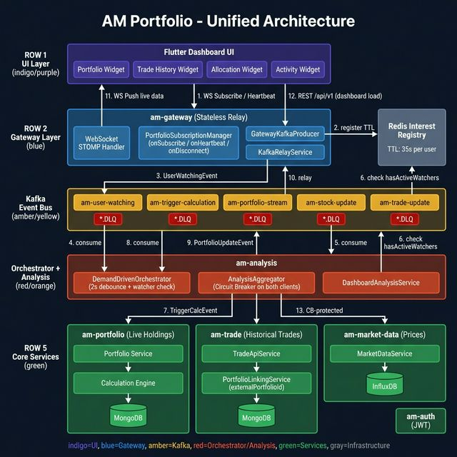

# AM Portfolio - Unified Architecture

## Overview
This document describes the full end-to-end architecture of the AM Portfolio platform,
covering the UI, Gateway, Kafka orchestration, and all backend services.

## Architecture Diagram



## Module Responsibilities

| Module | Role | Port |
|--------|------|------|
| `Flutter UI` | Dashboard, live portfolio streaming | 9005 |
| `am-gateway` | Stateless WebSocket relay, Redis interest tracking | 8091 |
| `am-analysis` | DemandDrivenOrchestrator + AnalysisAggregator | 8090 |
| `am-portfolio` | Live holdings, calculation engine | 8060 |
| `am-trade` | Historical trades, identity linking | 8040 |
| `am-market-data` | Real-time price data | 8020 |
| `am-auth` | JWT authentication | 8001 |

## Key Kafka Topics

| Topic | Producer | Consumer | Purpose |
|-------|----------|----------|---------|
| `am-user-watching` | am-gateway | am-analysis Orchestrator | Triggers demand-driven calc |
| `am-trigger-calculation` | Orchestrator | am-portfolio | Starts live portfolio calc |
| `am-portfolio-stream` | am-portfolio | am-gateway | Pushes results to UI |
| `am-stock-update` | am-market-data | Orchestrator | Market-driven recalc |
| `am-trade-update` | am-trade | Orchestrator | Trade-driven recalc |
| `*.DLQ` | All failed events | Ops/Retry | Dead letter queue |

## Live Streaming Flow

```
User Opens App
  → WS /portfolio/subscribe
  → Gateway registers in Redis (TTL 35s)
  → Emits USER_WATCHING → Kafka
  → Orchestrator: checks Redis, debounces 2s → TRIGGER_CALC
  → Portfolio Service calculates
  → PORTFOLIO_UPDATE → Kafka
  → Gateway relays → WS Push → UI updated live ✅
```

## Resilience Patterns

- **Circuit Breaker** (Resilience4j) on all cross-service REST calls
- **Redis TTL** auto-expires ghost users after 35 seconds
- **DLQ** on all Kafka topics for failed event replay
- **isComplete** flag in API response signals partial data to UI
- **Idempotent** trade identity linking via `PortfolioLinkingService`
