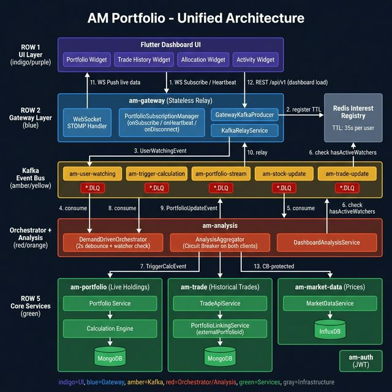

# AM Portfolio - Unified Architecture

## Overview
This document describes the full end-to-end architecture of the AM Portfolio platform,
covering the UI, Gateway, Kafka orchestration, and all backend services.

## Architecture Diagram



## Module Responsibilities

| Module | Role | Port |
|--------|------|------|
| `Flutter UI` | Dashboard, live portfolio streaming | 9005 |
| `am-gateway` | Stateless WebSocket relay, Redis interest tracking | 8091 |
| `am-analysis` | DemandDrivenOrchestrator + AnalysisAggregator | 8093 |
| `am-portfolio` | Live holdings, calculation engine | 8060 |
| `am-trade` | Historical trades, identity linking | 8040 |
| `am-market-data` | Real-time price data | 8020 |
| `am-auth` | JWT authentication | 8001 |

## Key Kafka Topics

| Topic | Producer | Consumer | Purpose |
|-------|----------|----------|---------|
| `am-user-watching` | am-gateway | am-analysis Orchestrator | Triggers demand-driven stream |
| `am-trigger-calculation` | Orchestrator (legacy) | am-portfolio | Legacy live calc rollback only |
| `am-portfolio-stream` | am-analysis | am-gateway | Pushes portfolio snapshot to UI |
| `am-portfolio-update` | am-portfolio | am-analysis adapter | Structural holdings → Mongo |
| `am-stock-price-update` | am-market-data | am-gateway, am-analysis | Live prices to UI + ingest |
| `am-trade-update` | am-trade | am-gateway, am-analysis | Trade events to UI + ingest |
| `dashboard-*-update` (5) | am-analysis | am-gateway | Dashboard widget streaming |

See **[gateway-streaming](./gateway-streaming/README.md)** for per-stream E2E flows, log grep checklist, and troubleshooting (portfolio, market, trade, dashboard).
| `*.DLQ` | All failed events | Ops/Retry | Dead letter queue |

## Live Streaming Flow

**Portfolio (demand-driven):**

```
User Opens App
  → WS /portfolio/subscribe
  → Gateway registers in Redis (TTL 35s)
  → Emits USER_WATCHING → Kafka
  → Orchestrator → PortfolioStreamingService (Mongo AnalysisEntity)
  → am-portfolio-stream → Gateway relay → WS Push → UI updated live
```

On market ticks: same orchestrator path with live price overlay (2s debounce per portfolio).
Structural holdings changes: am-portfolio → `am-portfolio-update` → adapter → Mongo → stream push if user is watching.

**Market:** UI SUBSCRIBE `/topic/stock/{symbol}` + SEND `/app/market/subscribe` → gateway proxies am-market connect → `am-stock-price-update` → gateway relay.

**Trade (passive):** UI SUBSCRIBE `/user/queue/trade` only → `am-trade-update` → gateway relay (no `/app/trade/*` controller).

**Dashboard:** UI SUBSCRIBE 5 queues + SEND `/app/dashboard/subscribe` → orchestrator → 5× `dashboard-*-update` → gateway relay.

Details: [gateway-streaming/streaming-guide.md](./gateway-streaming/streaming-guide.md)

## Resilience Patterns

- **Circuit Breaker** (Resilience4j) on all cross-service REST calls
- **Redis TTL** auto-expires ghost users after 35 seconds
- **DLQ** on all Kafka topics for failed event replay
- **isComplete** flag in API response signals partial data to UI
- **Idempotent** trade identity linking via `PortfolioLinkingService`
