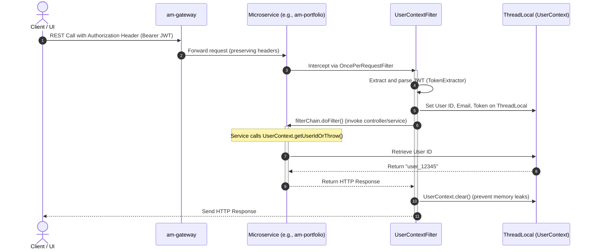

# 🔐 AM Security: Centralized UserContext Authentication Guide

This guide describes the **Centralized Thread-Local UserContext Authentication** architecture implemented in `am-security-lib`. It is designed as a plug-and-play shared library for all Spring Boot 3 microservices within the AM Portfolio platform (e.g., `am-portfolio`, `am-trade`, `am-analysis`).

---

## 🧭 Overview

In a distributed microservice architecture, propagating authenticated user identity (e.g., JWT credentials) down to deep service layers can easily lead to code clutter (e.g., passing `userId` as a parameter to every method). 

To solve this, `am-security-lib` introduces a **thread-bound request context** model:
1. **Stateless Gateway Routing:** The gateway routes incoming client requests with standard JWT `Authorization: Bearer <token>` headers.
2. **Intercepting Filter:** An automated filter intercepts requests, parses the JWT token, and binds the extracted user details (`userId`, `email`, and `token`) to the current execution thread.
3. **Thread-Safe Access:** Any component (controllers, services, calculations, database auditors) can query the static `UserContext` thread-local holder to retrieve the user's identity securely.
4. **Safety & Cleanliness:** The filter automatically clears the thread local properties post-request to avoid context leakage in container thread pools.

---

## 🏗️ Architecture & Workflow

Here is how the token processing workflow handles request authentication:



---

## 📦 Shared Library Structure (`am-security-lib`)

The shared library is located in `libraries/am-security-lib` and contains the following primary classes:

### 1. `UserContext.java`
A static utility class wrapping Java `ThreadLocal` storage. It provides getters and setters for the authenticated user context.

```java
package com.am.security.context;

import org.springframework.http.HttpStatus;
import org.springframework.web.server.ResponseStatusException;

public class UserContext {
    private static final ThreadLocal<String> userIdHolder = new ThreadLocal<>();
    private static final ThreadLocal<String> emailHolder = new ThreadLocal<>();
    private static final ThreadLocal<String> tokenHolder = new ThreadLocal<>();

    public static void setUserId(String userId) { userIdHolder.set(userId); }
    public static String getUserId() { return userIdHolder.get(); }

    /**
     * Foolproof extraction: Throws a 401 Unauthorized if the user is not authenticated.
     * Use this method in controllers/services to guarantee 100% security enforcement.
     */
    public static String getUserIdOrThrow() {
        String userId = userIdHolder.get();
        if (userId == null) {
            throw new ResponseStatusException(HttpStatus.UNAUTHORIZED, "User not authenticated or token missing");
        }
        return userId;
    }

    public static void setEmail(String email) { emailHolder.set(email); }
    public static String getEmail() { return emailHolder.get(); }

    public static void setToken(String token) { tokenHolder.set(token); }
    public static String getToken() { return tokenHolder.get(); }

    public static void clear() {
        userIdHolder.remove();
        emailHolder.remove();
        tokenHolder.remove();
    }
}
```

### 2. `UserContextFilter.java`
A Spring `OncePerRequestFilter` that intercepts the HTTP request, parses the JWT token, and binds the values to `UserContext` thread-local variables.

> [!IMPORTANT]
> The filter utilizes a `try-finally` block to guarantee `UserContext.clear()` is executed at the end of every request cycle. This is critical for preventing memory leaks and security boundary violations in reuse-heavy Tomcat/Undertow thread pools.

### 3. `UserContextAutoConfiguration.java`
Spring Boot auto-configuration that registers `UserContextFilter` as a bean globally when the library is loaded on the classpath. It is activated automatically on standard web applications via `@ConditionalOnWebApplication`.

---

## 🚀 How to Integrate & Consume

To leverage centralized authentication in any microservice module:

### Step 1: Add the Dependency
Add `am-security-lib` to the target service's `pom.xml`:

```xml
<dependency>
    <groupId>com.am.libraries</groupId>
    <artifactId>am-security-lib</artifactId>
    <version>1.0.0-SNAPSHOT</version>
</dependency>
```

### Step 2: Use in Controller / Service Layer
Injecting parameters or writing manual auth parsing blocks is no longer required. Simply call `UserContext.getUserIdOrThrow()`:

```java
@RestController
@RequestMapping("/api/v1/portfolio")
public class PortfolioController {

    @GetMapping("/holdings")
    public ResponseEntity<List<Holding>> getHoldings() {
        // Automatically throws a 401 ResponseStatusException if JWT is missing/invalid
        String userId = UserContext.getUserIdOrThrow(); 
        
        List<Holding> holdings = portfolioService.getHoldingsForUser(userId);
        return ResponseEntity.ok(holdings);
    }
}
```

---

## 🧪 Testing Strategy

Since `UserContext` uses a `ThreadLocal` structure, testing secured APIs is highly structured and does not require complex mock security architectures.

### Mocking Authentic requests in Integration Tests
When writing integration tests (e.g., using `MockMvc` or WebClient mock-ups), you can mock authenticated requests using either:

#### 1. Header-Based Propagation (Simulating Gateway/Auth requests)
Add a mock token to your HTTP headers to trigger parsing within the actual filter:

```java
mockMvc.perform(get("/api/v1/portfolio/holdings")
        .header("Authorization", "Bearer <mock_jwt_token_here>"))
        .andExpect(status().isOk());
```

#### 2. Manual Mocking Helper (ThreadLocal Injection)
For direct controller tests or integration tests, you can set the thread-local state programmatically prior to calling endpoints, and clean it up afterward:

```java
@BeforeEach
void setupUserContext() {
    UserContext.setUserId("test-user-id");
    UserContext.setEmail("test-user@example.com");
}

@AfterEach
void clearUserContext() {
    UserContext.clear();
}
```

> [!TIP]
> A helper class (`TestSecurityHelper.java`) is available in `portfolio-app` tests. It provides clean, automated static utilities to programmatically authorize requests without writing repetitive setup/teardown boilerplate in every test suite.
