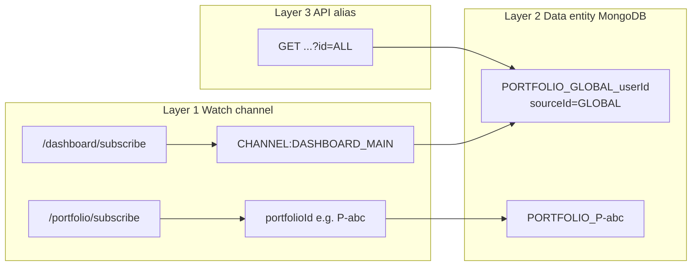
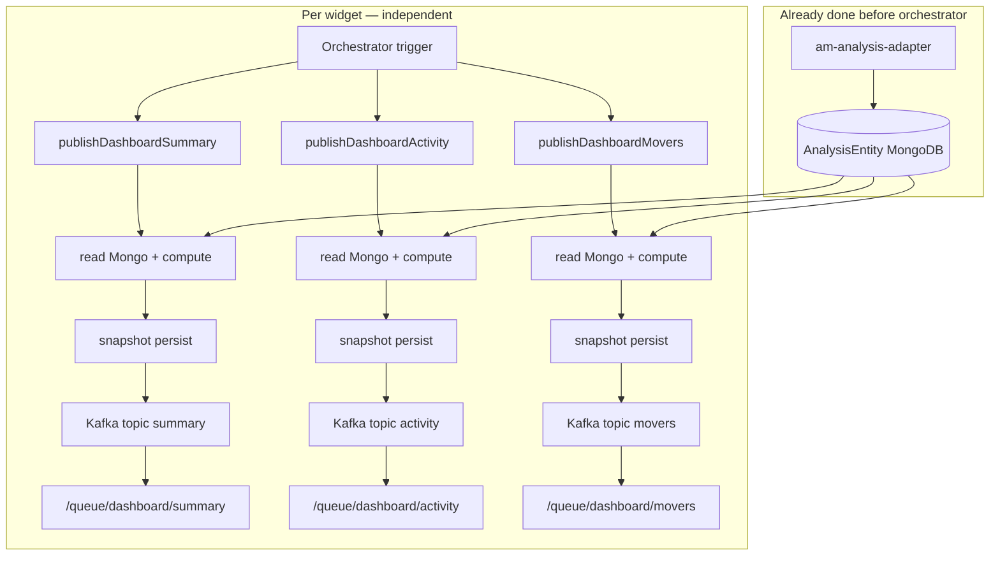
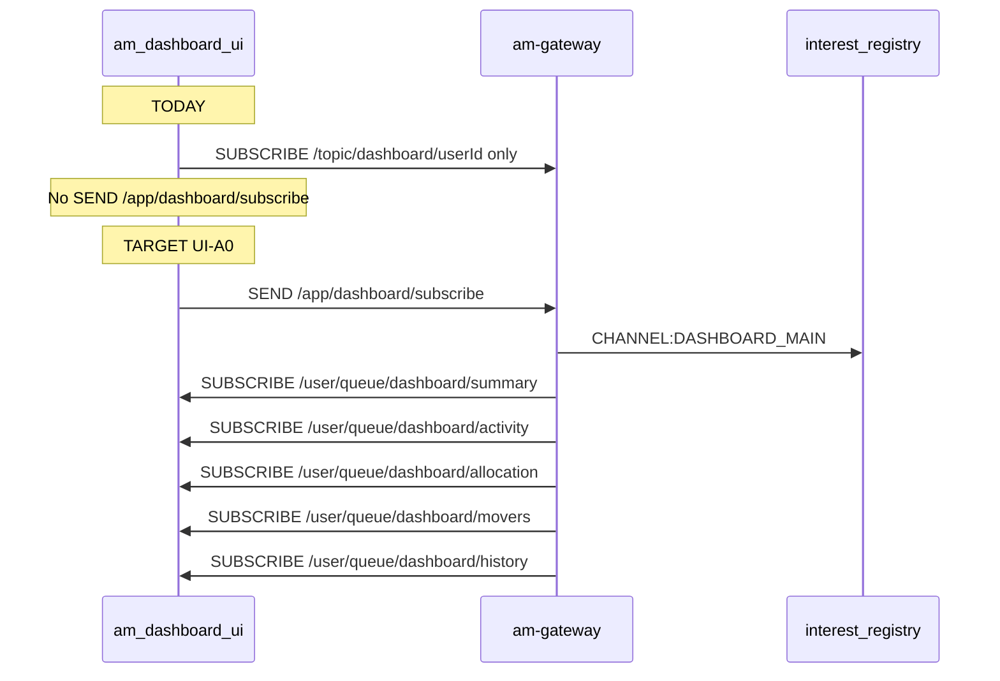
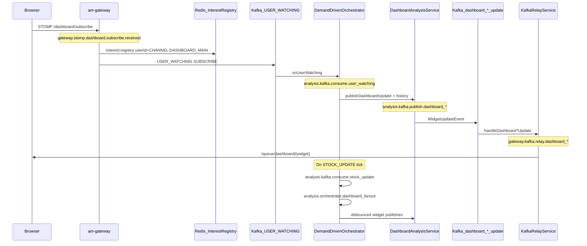

# Dashboard Streaming — Revised Implementation Plan

## Core Principle
`am-portfolio`, `am-market`, `am-trade` — no changes. They publish Kafka events.
`am-analysis-adapter` — already consumes all three. Already persists to MongoDB.
`am-analysis` — reads from MongoDB `AnalysisEntity`, calculates, persists snapshot, streams.
`am-gateway` — relays Kafka events to WebSocket. Holds in-memory Position Book for <5ms P&L.

---

## Plan status & execution readiness

| Metric | Value |
|--------|-------|
| **Overall design maturity** | 8/10 — architecture sound |
| **Implementation completion** | ~55% Phase D; ~40% full plan |
| **Blockers before production** | Security (STOMP Principal), `CHANNEL:DASHBOARD_MAIN` in registry, global portfolio ID for widget compute (not `"ALL"`), subscribe-all-5, activity debounce |
| **Review date** | Addressed in Part H (risks), Part I (security), prioritized execution below |

**Execution rule:** No item marked ✅ in this doc until its validation row(s) pass. See [Validation Checklist](#validation-checklist--required-before-merging-functional-changes).


> **Quick nav:** [Phased tasks](./phased-tasks.md) · [UI tasks](./ui-phased-tasks.md) · [Phase gates](./phased-tasks.md#phase-gates) · [Validation checklist](#validation-checklist--required-before-merging-functional-changes) · [Folder index](./README.md)

---

## Phased tasks (separate file)

Task tracking lives in **[phased-tasks.md](./phased-tasks.md)** — phase tables (A, C, A0, D, P1, P2, B, E, F), gates G0–G4, sprint mapping, and progress counts.

Update status there when completing work; keep this document for architecture and validation reference.

**Current focus (Sprint 1):** `A-05`, `A-06`, `A0-01` … `A0-11`

---

## What Already Exists (Do Not Rebuild)

```
Feed Services                  am-analysis-adapter (ALREADY WIRED)
─────────────                  ──────────────────────────────────
am-portfolio ──PORTFOLIO_UPDATE──▶ PortfolioEventListener  ✅
am-market    ──STOCK_UPDATE──────▶ MarketEventListener     ✅
am-trade     ──TRADE_UPDATE──────▶ TradeEventListener      ✅
                                       ↓
                              AnalysisIngestionService
                                       ↓
                         MongoDB: analysis_data (AnalysisEntity)
                         { holdings[]: InvestmentStats + MarketStats }
                         MarketStats already has: currentPrice, previousClose(1D), dayChange ✅
```

**AnalysisEntity in MongoDB is the single source of truth.**
All five dashboard widgets read from it. Nothing recalculates from raw DB.

---

## The Gap — What Is Missing

| Gap | Description |
|-----|-------------|
| **Multi-window prevClose** | `am-entity-previous-close-snapshot` topic not consumed (1W/1M/3M/6M/1Y/5Y windows — needed for history chart) |
| **Shared P&L formula** | `GainLossCalculator` in am-kafka-lib **done**; gateway Position Book integration still pending |
| **Dashboard streaming** | Widget Kafka publishers exist for summary/activity/allocation/movers; **history publisher missing**; orchestrator wiring **partial** (summary + movers on tick; activity + all-5 subscribe **pending**) |
| **Snapshot persistence** | `DashboardSnapshotService` + MongoDB/Redis layer **done**; wired into `DashboardAnalysisService` publish paths |
| **REST fallback** | Existing REST endpoints use snapshot layer via `DashboardSnapshotService.load()` — **done** for summary/activity; no dedicated `/snapshot/{widget}` paths (not required) |
| **Position Book (gateway)** | No inline <5ms P&L calc at WebSocket layer |

---

## Interest Registry — Demand Signal (Shared Redis)

The Interest Registry answers **"who is actively watching what right now?"** so `am-analysis` only computes/pushes for live WebSocket users.

**am-analysis reads Redis directly** — it does **not** call `am-gateway` over HTTP. Both services share the same Redis instance and key namespace.

```
am-gateway (WRITER)                         Shared Redis                         am-analysis (READER)
─────────────────                         ────────────                         ───────────────────
/portfolio/subscribe  ──register──▶  interest:registry  {userId→portfolioId}       ◀──getAllActiveUserIds()
/dashboard/subscribe  ──register──▶  interest:registry  {userId→CHANNEL:DASHBOARD_MAIN} ◀──getWatchedPortfolio()
heartbeat / disconnect ──TTL/del──▶  interest:sessions  {userId→sessionId}
```

| Redis key | Field | Value | TTL |
|-----------|-------|-------|-----|
| `interest:registry` | `userId` | `portfolioId` or `CHANNEL:DASHBOARD_MAIN` | 35s (refreshed on heartbeat) |
| `interest:sessions` | `userId` | WebSocket `sessionId` | 35s |

### Three-layer model — channel vs global portfolio vs API alias

**Problem:** `"ALL"` is overloaded. It was wrongly used for (1) interest registry, (2) REST API shorthand, while the backend **already has a real global portfolio entity** with its own ID.

**Do not conflate these three layers:**

| Layer | Question | Value | Where | Example |
|-------|----------|-------|-------|---------|
| **1. Watch channel** | Which WebSocket page is open? | `CHANNEL:DASHBOARD_MAIN` or `{portfolioId}` | `interest:registry`, orchestrator routing | User on main dashboard vs viewing portfolio `P-abc123` |
| **2. Data entity** | Which `AnalysisEntity` to read? | Global: `PORTFOLIO_GLOBAL_{userId}` (`sourceId=GLOBAL`) · Single: `PORTFOLIO_{portfolioId}` | MongoDB, widget compute, adapter ingest | Already created by adapter when `portfolioId` is null on `PORTFOLIO_UPDATE` |
| **3. API alias (legacy)** | REST query param convenience | `"ALL"` / `null` → resolves to layer 2 global entity | `AnalysisController`, `getAllocation("ALL", …)` | **Backward compat only** — map to `GlobalPortfolioResolver`, never write to Redis |



**Global portfolio already exists in code** (`AnalysisEventMapper`):

```java
// When PORTFOLIO_UPDATE has portfolioId=null → combined all-portfolios snapshot
effectivePortfolioId = "GLOBAL";
entityId = "PORTFOLIO_GLOBAL_" + userId;   // e.g. PORTFOLIO_GLOBAL_user123
```

`AllocationAnalysisService` already prefers `PORTFOLIO_GLOBAL_{userId}` before dynamic aggregation. Dashboard widgets should use the **same entity ID**, not the string `"ALL"`.

**Agreed constants** (`am-kafka-lib`):

```java
// InterestRegistryKeys.java — Layer 1 only (never a portfolio ID)
public static final String CHANNEL_DASHBOARD_MAIN = "CHANNEL:DASHBOARD_MAIN";

// AnalysisEntityKeys.java — Layer 2
public static final String GLOBAL_SOURCE_ID = "GLOBAL";
public static String globalEntityId(String userId) {
    return "PORTFOLIO_GLOBAL_" + userId;
}
public static boolean isGlobalSourceId(String sourceId) {
    return GLOBAL_SOURCE_ID.equals(sourceId);
}
```

**`GlobalPortfolioResolver` (new, am-analysis):**

```java
/** Dashboard / aggregated views: resolve Mongo entity for combined portfolios. */
Optional<AnalysisEntity> resolveGlobal(String userId);
String globalSourceId();  // "GLOBAL" — for logging only
```

Use in `DashboardAnalysisService.publishDashboard*` instead of `getAllocation("ALL", …)` / `getTopMovers(null, …)`.

**What to do with `"ALL"`:**

| Location | Action |
|----------|--------|
| `interest:registry` | **Remove** — use `CHANNEL:DASHBOARD_MAIN` only |
| `PortfolioController.subscribeDashboard` | Pass `CHANNEL_DASHBOARD_MAIN`, not `"ALL"` |
| `DashboardAnalysisService`, orchestrator | Use `GlobalPortfolioResolver` / `globalEntityId(userId)` |
| REST `AnalysisController` (`id=ALL`) | Keep as **alias** → resolver maps to `PORTFOLIO_GLOBAL_{userId}` (backward compat) |
| `TriggerCalcEvent` / portfolio channel | Use real `{portfolioId}` from subscribe — never `"ALL"` |

**Single-channel rule (Layer 1):** one watch target per user. Main dashboard → `CHANNEL:DASHBOARD_MAIN`; single-portfolio page → that portfolio's real ID.

**Dashboard widget compute (Layer 2):** when watch channel is `CHANNEL:DASHBOARD_MAIN`, all widgets read from `PORTFOLIO_GLOBAL_{userId}` (or aggregate holdings across non-`_GLOBAL` entities if global entity missing — same fallback as `AllocationAnalysisService` today).

### Channel naming options (Layer 1 only)

| Option | Verdict |
|--------|---------|
| `CHANNEL:DASHBOARD_MAIN` | **Chosen** — UI channel; pairs with global entity `PORTFOLIO_GLOBAL_{userId}` |
| `"ALL"` in registry | **Rejected** — collides with API/data semantics |
| Real `portfolioId` on dashboard subscribe | **Rejected** — dashboard is not a single portfolio; it's the global combined view |

### Security (Layer 1 + STOMP) — raised from 5.5/10 target 9/10

JWT is validated on STOMP CONNECT (`SecurityConfig` sets `Principal`). Subscribe handlers must use **Principal**, not client payload:

| Rule | Implementation |
|------|----------------|
| `userId` source | `headerAccessor.getUser().getName()` after CONNECT |
| Payload `userId` | Optional; if present must equal Principal or reject (SEC-2) |
| Registry write | Always authenticated Principal's id |
| Global entity access | `GlobalPortfolioResolver` scopes by same `userId` — never cross-user |

See Part I (task **A0-01**).

### Main dashboard channel — what gets calculated and streamed?

**Not one big batch.** Each widget is an **independent pipeline**: compute → persist snapshot → Kafka publish → gateway relay → WebSocket. Widgets do **not** wait for each other.



| Question | Answer |
|----------|--------|
| Is all dashboard data calculated in one job? | **No.** Each `publishDashboard*` method computes **one widget** from `AnalysisEntity` (already in Mongo). |
| Does widget B wait for widget A? | **No.** Separate methods, separate Kafka topics, separate WebSocket queues. UI updates each card as its message arrives. |
| Is it async today? | **Sync per widget in the Kafka listener thread** — compute → persist → send run sequentially inside each `publishDashboard*` call. `publishDashboardUpdate()` calls 4 widgets **one after another** in the same thread (subscribe path). Market tick only invokes the debounced subset (summary/activity/movers), not all 5. |
| Future async option? | Optional: `@Async` or `CompletableFuture` per widget on subscribe so 5 widgets publish in parallel. **Not required for v1** — independent streams already give progressive UI load. |
| Where does heavy calc happen? | **am-analysis-adapter** on `PORTFOLIO_UPDATE` / `STOCK_UPDATE` ingestion updates `AnalysisEntity`. Widget publish mostly **aggregates/maps** holdings already in Mongo. |
| Snapshot vs stream | **Both, same request:** `persist()` then `kafkaTemplate.send()` — snapshot is durability/fallback; Kafka is live push. Not fire-and-forget async persist today. |

**What runs on `CHANNEL:DASHBOARD_MAIN` by event:**

| Event | Widgets triggered | Debounce |
|-------|-------------------|----------|
| **Subscribe** (`USER_WATCHING`) | All 5: summary, activity, allocation, movers, history | None (immediate) |
| **STOCK_UPDATE** (market tick) | summary, activity, movers only | 1s / 5s / 5s per user |
| **PORTFOLIO_UPDATE** | All via `DashboardUpdateListener` → `publishDashboardUpdate` (+ history when added) | N/A (holdings changed) |
| **History 1D append** (Phase E) | history only — append one chart point | Per tick, not full recompute |

**UI implication:** Main dashboard page should subscribe to **all** `/queue/dashboard/*` topics up front. Each widget card fills in independently — REST snapshot loads in parallel for instant paint, WebSocket replaces live.

**Two coordination paths:**

| Path | When | Purpose |
|------|------|---------|
| **Redis Interest Registry** | Every `STOCK_UPDATE` | Batch fan-out: who gets calc vs dashboard pushes |
| **Kafka `USER_WATCHING`** | Subscribe / unsubscribe / heartbeat | Immediate action on subscribe (first calc or initial widget push) |

**Implementation note:** Consolidate to **one** `InterestRegistryService` in kafka-lib (Part H L5). Gateway must not keep a duplicate copy.

Both services must point at the **same Redis cluster** (configured per-service in `application.yml` / Helm vault).

---

Every widget follows this exact pattern. No exceptions.

```
DemandDrivenOrchestrator fires (STOCK_UPDATE or PORTFOLIO_UPDATE)
        │
        ▼
DashboardAnalysisService.compute(userId, widget)
   reads AnalysisEntity from MongoDB (already fresh, ingested by adapter)
        │
        ├──▶ [1] Kafka → am-gateway → WebSocket /queue/dashboard/{widget}   (live, <50ms)
        │
        └──▶ [2] DashboardSnapshotService.persist(userId, widget, data)      (sync, same thread)
                   ├── Redis SET dashboard:snapshot:{userId}:{widget}  TTL=5min
                   └── MongoDB UPSERT dashboard_snapshots { userId, widget, data, calculatedAt }
```

> **Note:** Snapshot persist is **synchronous** before Kafka send (not fire-and-forget async). Failures are logged; Kafka is not sent if compute fails. Optional future: async persist with outbox pattern — not in v1.

**UI load sequence (what the client does):**
```
1. Connect WebSocket → subscribe to all dashboard topics
2. Simultaneously: GET /dashboard/snapshot/{widget}   ← REST, returns instantly
3. Show snapshot data (may be seconds/minutes old but never blank)
4. WebSocket updates arrive → replace snapshot values live
5. If WebSocket drops → data stays frozen at last snapshot
6. On reconnect → step 1 again
```

**Read priority for REST fallback:**
```
Redis hit  →  return instantly (TTL 5min)
Redis miss →  MongoDB snapshot → re-warm Redis → return
MongoDB miss → recompute live → persist → return
```

---

## Three Storage Layers

```
Layer 1: WebSocket stream        live, ephemeral, push
Layer 2: Redis cache             fast fallback, TTL 5 min per widget
Layer 3: MongoDB dashboard_snapshots  durable, no TTL, always available
```

---

## Part A — Shared Foundation (`am-kafka-lib`)

### [NEW] `GainLossCalculator.java` ✅ done
Pure static utility. No Spring, no I/O. Used by `am-analysis` and `am-gateway`.
```java
todayGainLoss(qty, currentPrice, prevClose)   → qty × (cur − prev)
totalGainLoss(qty, currentPrice, avgBuy)      → qty × (cur − avg)
gainLossPercent(gainLoss, investmentValue)    → (gain / investment) × 100
currentValue(qty, price)                     → qty × price
```

### [NEW] `PreviousCloseSnapshot.java`
Kafka event model matching Market-Data-Scheduler payload:
```java
String source, id, stockName, snapshotDate
Map<String, Double> previousCloseValues  // "1D"→2450.75, "1W"→2420.10, ...
```

### [NEW] `MarketDataKeys.java` ✅ done
Redis key constants shared across all services:
```java
PREV_CLOSE_PREFIX       = "prev-close:"          // prev-close:RELIANCE → Hash
DASHBOARD_SNAPSHOT_PREFIX = "dashboard:snapshot:" // dashboard:snapshot:{userId}:{widget}
WINDOW_1D = "1D", WINDOW_1W = "1W" ... WINDOW_5Y = "5Y"
```

### [MODIFY] `KafkaTopics.java`
Add:
```java
PREVIOUS_CLOSE_SNAPSHOT = "am-entity-previous-close-snapshot"  // already added ✅
```

---

## Part B — Previous-Close Multi-Window Ingestion (`am-analysis-adapter`)

### [NEW] `PreviousCloseSnapshotListener.java`
Follows the exact same pattern as `MarketEventListener`. Lives in `am-analysis-adapter`.

```java
@KafkaListener(topics = KafkaTopics.PREVIOUS_CLOSE_SNAPSHOT, groupId = "am-analysis-group")
public void listen(String message) {
    PreviousCloseSnapshot snapshot = objectMapper.readValue(message, PreviousCloseSnapshot.class);
    previousCloseRedisService.write(snapshot.getId(), snapshot.getPreviousCloseValues());
}
```

Persists to Redis only (not MongoDB) — this is market reference data, regenerated daily.
TTL = 48 hours (survives weekends).

Redis structure:
```
HSET prev-close:RELIANCE   1D 2450.75   1W 2420.10   1M 2380.45 ...
EXPIRE prev-close:RELIANCE 172800
```

---

## Part C — Snapshot Infrastructure (`am-analysis`)

### [NEW] `DashboardSnapshot.java`  ← MongoDB document
```java
@Document("dashboard_snapshots")
public class DashboardSnapshot {
    @Id String id;              // userId:widget
    String userId;
    String widget;              // SUMMARY | ACTIVITY | ALLOCATION | MOVERS | HISTORY
    Object data;                // serialized widget DTO
    LocalDateTime calculatedAt;
    boolean isStale;            // true if underlying data changed but recalc pending
}
```

### [NEW] `DashboardSnapshotRepository.java`
```java
MongoRepository<DashboardSnapshot, String>
findByUserIdAndWidget(userId, widget)
```

### [NEW] `DashboardSnapshotService.java` ✅ done
Two responsibilities: write (after every calculation) + read (REST fallback).

```java
// Write path (called after every successful calculation)
void persist(String userId, String widget, Object data)
    → Redis SET dashboard:snapshot:{userId}:{widget}  data  TTL=5min
    → MongoDB UPSERT { id: userId:widget, data, calculatedAt: now() }

// Read path (REST endpoint fallback)
Optional<Object> load(String userId, String widget)
    → Redis hit  → return immediately
    → Redis miss → MongoDB → re-warm Redis → return
    → MongoDB miss → return empty (triggers recompute)
```

### [MODIFY] `AnalysisController.java`
Add REST fallback endpoints UI calls on page load:
```
GET /analysis/dashboard/snapshot/summary      → DashboardSummary
GET /analysis/dashboard/snapshot/activity     → RecentActivityResponse
GET /analysis/dashboard/snapshot/allocation   → AllocationResponse
GET /analysis/dashboard/snapshot/movers       → TopMoversResponse
GET /analysis/dashboard/snapshot/history?window=1D → HistoryResponse
```

These endpoints **already exist** in `AnalysisController.java`:
```
GET /v1/analysis/dashboard/summary          ✅ exists
GET /v1/analysis/dashboard/top-movers       ✅ exists
GET /v1/analysis/dashboard/performance      ✅ exists
GET /v1/analysis/dashboard/recent-activity  ✅ exists
GET /v1/analysis/{type}/{id}/allocation     ✅ exists
```

What changes: the **service layer** (`DashboardAnalysisService`, `AnalysisServiceImpl`) behind these
endpoints gets a `DashboardSnapshotService` wired in. Each `get*()` method will:
1. Try `DashboardSnapshotService.load(userId, widget)` first → Redis → MongoDB
2. Fall back to live compute from `AnalysisRepository` if snapshot absent
3. Persist result back to snapshot store before returning

**No new endpoints needed. No changes to `AnalysisController.java`.**

### Phase D — Remaining work (must pass validation checklist before merge)

| Item | File | Status |
|------|------|--------|
| Activity 5s debounce on `STOCK_UPDATE` | `DemandDrivenOrchestrator.java` | ⏳ pending |
| Rename watch target `ALL` → `CHANNEL:DASHBOARD_MAIN` | `InterestRegistryService`, gateway, orchestrator | ⏳ pending |
| Subscribe → all 5 widgets immediately | `DemandDrivenOrchestrator.java` + `DashboardAnalysisService.java` | ⏳ partial (summary + movers only today) |
| `publishDashboardHistory(userId, window)` | `DashboardAnalysisService.java` | ⏳ pending |
| `analysis.orchestrator.dashboard_fanout` span | `DemandDrivenOrchestrator.java` | ⏳ pending (Part G) |
| `analysis.orchestrator.subscribe_dashboard_push` span | `DemandDrivenOrchestrator.java` | ⏳ pending (Part G) |
| Migrate `DashboardSnapshotService` to `FlowLogger` | `DashboardSnapshotService.java` | ⏳ pending (Part G) |
| Live 1D history append on tick | `HistoryStreamingService.java` | Phase E |
| STOMP userId from JWT Principal | `PortfolioController.java` | ⏳ P0 (Part I) |
| Consolidate InterestRegistryService to kafka-lib | gateway deletes duplicate | ⏳ P0 (Part H L5) |
| PORTFOLIO_UPDATE Kafka gating | `DashboardUpdateListener.java` | ⏳ P1 (Part H L2) |
| Redis debounce for multi-instance | `DemandDrivenOrchestrator.java` | ⏳ P1 (Part H L4) |
| WidgetUpdateEvent traceId | `DashboardAnalysisService.java` | ⏳ P1 (Part H L6) |
| Symbol-aware tick fan-out | orchestrator or publish layer | ⏳ P2 (Part H L3) |
| Parallel @Async subscribe publish | `DashboardAnalysisService.java` | ⏳ P2 |
| Deprecate DASHBOARD_UPDATE relay | `KafkaRelayService.java` | ⏳ P2 (Part H L12) |
| Unit tests orchestrator + registry | `src/test/java` | ⏳ P2 |

---

## Part D — Dashboard Streaming: 5 Widgets (`am-analysis`)

### [MODIFY] `DashboardAnalysisService.java`

Add `publishAllWidgets(String userId)` — called by Orchestrator on each relevant trigger.
Reads from `AnalysisRepository` (already populated by adapter), enriches with `GainLossCalculator`,
publishes to Kafka (→ gateway → WebSocket) AND calls `DashboardSnapshotService.persist()`.

#### Widget 1 — Summary
- **Data source:** `AnalysisEntity` (type=PORTFOLIO) → sum across all holdings
- **dayChange:** `MarketStats.previousClose` already in entity → `GainLossCalculator.todayGainLoss`
- **WebSocket:** `/queue/dashboard/summary`
- **Trigger:** every STOCK_UPDATE affecting user's holdings
- **Snapshot:** persisted after every publish

#### Widget 2 — Activity (Holdings List)
- **Data source:** `AnalysisEntity.holdings[]` → already mapped to `ActivityItem`
- **dayChange fields:** recompute from `MarketStats.previousClose` using `GainLossCalculator`
- **WebSocket:** `/queue/dashboard/activity`
- **Trigger:** `STOCK_UPDATE` with **5s debounce per user** (dashboard channel only); also on subscribe (immediate)
- **Snapshot:** full list persisted after each publish

#### Widget 3 — Allocation
- **Data source:** `AnalysisEntity.holdings[]` → group by sector/assetClass/marketCap
- **Update:** values change when holdings change (not every price tick)
- **WebSocket:** `/queue/dashboard/allocation`
- **Trigger:** `PORTFOLIO_UPDATE` via `DashboardUpdateListener` (+ immediate on dashboard subscribe)
- **Snapshot:** persisted after publish

#### Widget 4 — Movers & Gainers
- **Data source:** `AnalysisEntity.holdings[]` → sort by `dayChangePercentage`
- **Recompute:** top 5 gainers + bottom 5 losers by today's % change
- **WebSocket:** `/queue/dashboard/movers`
- **Trigger:** every STOCK_UPDATE batch, **debounced 5 seconds per user**
- **Snapshot:** persisted after each debounced publish

#### Widget 5 — Portfolio Value History (Chart)
- **Data source for 1D:** append current computed portfolio value on each price tick
- **Data source for 1W/1M/3M:** read `prev-close:{symbol}` Redis Hash (multi-window data from Part B)
- **WebSocket:** `/queue/dashboard/history`
- **Trigger:** subscribe → full series; each tick → append 1D point
- **Snapshot:** full series persisted; REST loads it for page refresh

### [NEW] `HistoryStreamingService.java`
Builds portfolio value history series:
```java
getHistorySeries(userId, window)   // reads prevClose Redis Hash for 1W/1M/3M
appendCurrentValue(userId, value)  // appends live value to 1D intraday series
```

### [MODIFY] `DemandDrivenOrchestrator.java` — Phase D (partial ✅)

Expand `onMarketUpdate()` to trigger dashboard widget pushes **in addition to** per-user `TRIGGER_CALCULATION` (Phase 1 fix ✅).

**Channel routing** (reads Redis Interest Registry on every `STOCK_UPDATE`):

| Watch target | `onMarketUpdate()` behaviour |
|--------------|------------------------------|
| `portfolioId` | `triggerCalculationForActiveWatchers()` → `TRIGGER_CALCULATION` (2s debounce per portfolio) |
| `CHANNEL:DASHBOARD_MAIN` | `triggerDashboardUpdatesForActiveWatchers()` → widget Kafka publishes (no portfolio calc) |

```java
onMarketUpdate():
  triggerCalculationForActiveWatchers("MARKET_MOVE")   // portfolio-channel only ✅
  triggerDashboardUpdatesForActiveWatchers()         // CHANNEL:DASHBOARD_MAIN only
    → triggerDashboardSummaryUpdate(userId, debounce=true)   // 1s  ✅ implemented
    → triggerDashboardActivityUpdate(userId, debounce=true)  // 5s  ⏳ pending
    → triggerDashboardMoversUpdate(userId, debounce=true)    // 5s  ✅ implemented
  // allocation → PORTFOLIO_UPDATE via DashboardUpdateListener (not on tick)
  // history full series → dashboard subscribe; 1D append → Phase E (HistoryStreamingService)
```

**`onUserWatching()` SUBSCRIBE:**

| Watch target | Behaviour |
|--------------|-----------|
| `portfolioId` | `triggerCalculation(..., "USER_SUBSCRIPTION")` ✅ |
| `CHANNEL:DASHBOARD_MAIN` | Immediate push **all 5 widgets** (no debounce) ⏳ partial — today only summary + movers |

Subscribe immediate push should call:
```java
dashboardAnalysisService.publishDashboardUpdate(userId);  // summary, activity, allocation, movers
dashboardAnalysisService.publishDashboardHistory(userId, "1D");  // ⏳ publishDashboardHistory() not yet added
```

### [MODIFY] `DashboardAnalysisService.java` — pending items

- `publishDashboardSummary/Activity/Allocation/Movers` ✅ done (Kafka + snapshot persist)
- Split **persist** vs **kafkaPublish** for PORTFOLIO_UPDATE gating (Part J) ⏳ P1
- `WidgetUpdateEvent`: add `traceId`, `spanId` via `TracingHelper` ⏳ P1
- `publishDashboardHistory(userId, window)` ⏳ P0 — interim: `PerformanceAnalysisService.getPerformance("ALL", PORTFOLIO, window, userId)`
- `publishDashboardSubscribeAll(userId)` ⏳ P0 — all 5 widgets; P2 optional `@Async` parallel

### [EXISTS] Gateway dashboard subscribe — no new analysis controller needed

`PortfolioController` in **am-gateway** already handles STOMP subscribe (not a separate `DashboardStreamingController` in am-analysis):

```java
@MessageMapping("/dashboard/subscribe")   // PortfolioController.java ✅
  → subscriptionManager.onSubscribe(userId, CHANNEL_DASHBOARD_MAIN, sessionId)  // writes Redis + USER_WATCHING Kafka
@MessageMapping("/dashboard/unsubscribe")  // ✅
```

Gateway relays all 5 widget Kafka topics in `KafkaRelayService` ✅.

---

## Part E — WebSocket Topic Map

| Topic | Type | Widget | Triggered by |
|-------|------|--------|--------------|
| `/queue/dashboard/summary` | user-private | Summary header | STOCK_UPDATE (debounce 1s, dashboard channel) |
| `/queue/dashboard/activity` | user-private | Holdings list | STOCK_UPDATE (debounce 5s, dashboard channel) + subscribe |
| `/queue/dashboard/allocation` | user-private | Allocation pie | PORTFOLIO_UPDATE + subscribe |
| `/queue/dashboard/movers` | user-private | Movers/Gainers | STOCK_UPDATE (debounce 5s, dashboard channel) |
| `/queue/dashboard/history` | user-private | Value chart | Subscribe (full series) + 1D tick append (Phase E) |
| `/queue/portfolio` | user-private | Portfolio UI | Every tick — Position Book inline |
| `/queue/trade/live` | user-private | Trade UI | Every tick on open positions |
| `/topic/stock/{symbol}` | broadcast | Raw price feed | Every tick (existing) |

**Deprecated (remove after UI migration):** `/topic/dashboard/{userId}` — legacy `DASHBOARD_UPDATE` relay; Flutter still uses this today (see Part M).

---

## Part M — Flutter UI (`am-modern-ui`)

Full UI task tables: [ui-phased-tasks.md](./ui-phased-tasks.md).

### Package layout

| Package | Path | Streaming role |
|---------|------|----------------|
| `am_dashboard_ui` | `am-modern-ui/am_dashboard_ui` | Dashboard REST + STOMP (primary migration target) |
| `am_analysis` (`am_analysis_ui`) | `am-modern-ui/am_analysis/ui` | Analysis REST only — no STOMP |
| `am_library` | `am-modern-ui/am_library/lib/core/network/websocket/am_stomp_client.dart` | Shared STOMP client |
| `am_common` | `am-modern-ui/am_common/lib/core/network/websocket/stomp_connection_cubit.dart` | JWT on CONNECT |
| `am_app` | `am-modern-ui/am_app/lib/features/shell/app_shell.dart` | Global STOMP lifecycle |

> Note: folder `am_analysis_ui` at repo root is sparse; the `am_analysis/ui` package is the analysis UI module.

### Current vs target STOMP flow



### REST endpoints (unchanged — snapshot-backed)

| Widget | REST (page load) | STOMP (live) |
|--------|------------------|--------------|
| Summary | `GET /v1/analysis/dashboard/summary` | `/user/queue/dashboard/summary` |
| Activity | `GET /v1/analysis/dashboard/recent-activity` | `/user/queue/dashboard/activity` |
| Allocation | `GET /v1/analysis/PORTFOLIO/ALL/allocation` | `/user/queue/dashboard/allocation` |
| Movers | `GET /v1/analysis/dashboard/top-movers` | `/user/queue/dashboard/movers` |
| History | `GET /v1/analysis/dashboard/performance` | `/user/queue/dashboard/history` |

`PORTFOLIO/ALL` in allocation REST is the **API alias** (Layer 3) — keep in UI; do not use for STOMP/registry.

### Key files to modify

| File | Change |
|------|--------|
| `am_dashboard_ui/lib/data/repositories/dashboard_repository.dart` | Add subscribe/unsubscribe; 5 queue streams; drop `/topic/dashboard/{userId}` |
| `am_dashboard_ui/lib/presentation/providers/dashboard_provider.dart` | Per-widget REST→STOMP `StreamProvider`s |
| `am_dashboard_ui/lib/presentation/pages/dashboard_page.dart` | Wire all widget streams |
| `am_app/lib/features/shell/app_shell.dart` | Dashboard subscribe lifecycle; fix portfolio/dashboard channel conflict |
| `am_portfolio_ui/.../global_portfolio_wrapper.dart` | Defer portfolio STOMP when dashboard active (IR-5) |

### UI gaps vs backend (P0)

| Gap | UI today | Backend plan |
|-----|----------|--------------|
| Dashboard subscribe | Missing | `CHANNEL:DASHBOARD_MAIN` in registry |
| Widget queues | 1 legacy topic, summary only | 5 `/user/queue/dashboard/*` |
| Payload | `json['summary']` wrapper | Direct widget DTO (`GW-2`) |
| Channel exclusivity | Portfolio subscribe runs on dashboard tab | IR-5 |
| STOMP `userId` body | Sent on portfolio subscribe | Principal from JWT (A0-01) |

### Cross-reference: backend ↔ UI tasks

| Backend | UI |
|---------|-----|
| A0-01, A0-02 | UI-P1-01, UI-A0-01 |
| A0-08, US-2 | UI-A0-09 |
| GW-1, GW-2 | UI-A0-03…08 |
| P2-07 (deprecate legacy relay) | UI-P2-01 |
| E-01…E-04 | UI-E-01…03 |

---

## Part F — Position Book (`am-gateway`)

### [NEW] `PreviousCloseRedisService.java` (gateway-side reader)
Reads `prev-close:{symbol}` Redis Hash written by `PreviousCloseSnapshotListener`.
Used by `PositionBookClient` at subscribe time.

### [NEW] `PositionBookClient.java`
On user subscribe:
1. Calls portfolio service REST `GET /v1/portfolios/holdings` → loads positions
2. For each symbol: reads `HGET prev-close:{symbol} 1D` from Redis
3. Builds `PositionBook` in JVM memory

### [NEW] `PositionBookService.java`
On every `STOCK_UPDATE`:
```java
for each price in batch:
  for each user watching that symbol:
    PositionEntry entry = book.get(symbol)
    todayGainLoss  = GainLossCalculator.todayGainLoss(qty, newPrice, entry.prevClose)
    totalGainLoss  = GainLossCalculator.totalGainLoss(qty, newPrice, entry.avgBuy)
    currentValue   = GainLossCalculator.currentValue(qty, newPrice)
    push to /queue/portfolio  →  <5ms
    push to /queue/trade/live →  <5ms
```

### [MODIFY] `PortfolioSubscriptionManager.java`
`onSubscribe()` → call `positionBookService.load(userId, portfolioId)`
`onDisconnect()` → call `positionBookService.evict(userId)`

### [MODIFY] `KafkaRelayService.java` ✅ done
Relay for dashboard widget topics:
- `DASHBOARD_SUMMARY_UPDATE` → `/queue/dashboard/summary`
- `DASHBOARD_MOVERS_UPDATE` → `/queue/dashboard/movers`
- `DASHBOARD_ACTIVITY_UPDATE` → `/queue/dashboard/activity`
- `DASHBOARD_ALLOCATION_UPDATE` → `/queue/dashboard/allocation`
- `DASHBOARD_HISTORY_UPDATE` → `/queue/dashboard/history`

---

## Part G — Observability & Flow Tracing (`am-observability-lib`)

All dashboard streaming work **must** use [`am-observability-lib`](am-core-services/libraries/am-observability-lib) for end-to-end traceability. Reference docs:

- [DEVELOPER_GUIDE.md](observability/DEVELOPER_GUIDE.md) — how to wire `FlowLogger`, naming rules, Kafka/STOMP patterns
- [ARCHITECTURE.md](observability/ARCHITECTURE.md) — trace propagation stack (Micrometer + W3C `traceparent` + OTLP)

### What the library provides

| Component | Role in dashboard streaming |
|-----------|----------------------------|
| **`FlowLogger` + `FlowSpan`** | Structured business-flow checkpoints (`marker:FLOW`); stamps MDC `flow.id`, `flow.step`, `flow.user` |
| **`TracingHelper`** | Populate `traceId`/`spanId` on Kafka event payloads (`TriggerCalcEvent`, `WidgetUpdateEvent`) from active Micrometer span |
| **`TracingKafkaConsumerInterceptor`** | Restores `traceparent` on `@KafkaListener` consume (auto — no manual header copy) |
| **`TracingKafkaProducerInterceptor`** | Stamps `traceparent` on `KafkaTemplate.send` (auto) |
| **`StompTracingChannelInterceptor`** | Opens trace on STOMP subscribe/heartbeat (gateway — auto) |
| **`Sanitizer`** | Safe payload previews at DEBUG only — never log full Kafka bodies at INFO |

**Rule:** Micrometer handles wire propagation; **`FlowLogger` is manual** at every entry point. Do not use ad-hoc `log.info("[Snapshot]...")` for flow checkpoints.

### End-to-end dashboard trace (one `flow.id` / `traceId`)



Grep one user's journey in logs:

```logql
{service=~"am-gateway|am-analysis"} | json | flow_id="<traceId>" | marker="FLOW"
```

Or by user:

```logql
{service="am-analysis"} | json | userId="<userId>" | marker="FLOW" | flow_step=~"analysis\\.(kafka|orchestrator).*dashboard.*"
```

### Mandatory `FlowLogger` step registry

Naming convention: `<service>.<area>.<verb>[.detail]` (see DEVELOPER_GUIDE §5).

#### am-gateway (mostly ✅ — verify on changes)

| Step name | Location | Status |
|-----------|----------|--------|
| `gateway.stomp.dashboard.subscribe.received` | `PortfolioController.subscribeDashboard` | ✅ |
| `gateway.stomp.subscribe.received` | `PortfolioController.subscribe` | ✅ |
| `gateway.kafka.publish.user_watching` | `PortfolioSubscriptionManager` | ✅ |
| `gateway.redis.register` | `PortfolioSubscriptionManager` (via `flowLogger.step`) | ✅ |
| `gateway.kafka.relay.dashboard_summary` | `KafkaRelayService` | ✅ |
| `gateway.kafka.relay.dashboard_activity` | `KafkaRelayService` | ✅ |
| `gateway.kafka.relay.dashboard_allocation` | `KafkaRelayService` | ✅ |
| `gateway.kafka.relay.dashboard_movers` | `KafkaRelayService` | ✅ |
| `gateway.kafka.relay.dashboard_history` | `KafkaRelayService` | ✅ |

#### am-analysis — orchestrator (partial — extend on Phase D completion)

| Step name | Location | Status | Required fields on `complete`/`step` |
|-----------|----------|--------|--------------------------------------|
| `analysis.kafka.consume.stock_update` | `DemandDrivenOrchestrator.onMarketUpdate` | ✅ | `payload_bytes` |
| `analysis.kafka.consume.user_watching` | `DemandDrivenOrchestrator.onUserWatching` | ✅ | `action`, `userId` |
| `analysis.orchestrator.dashboard_fanout` | **NEW** span wrapping `triggerDashboardUpdatesForActiveWatchers` | ⏳ | `active_users`, `dashboard_users`, `widgets_triggered` |
| `analysis.orchestrator.dashboard_summary_debounced` | debounce skip | ✅ | `userId`, `window_ms` |
| `analysis.orchestrator.dashboard_activity_debounced` | debounce skip (when activity added) | ⏳ | `userId`, `window_ms` |
| `analysis.orchestrator.dashboard_movers_debounced` | debounce skip | ✅ | `userId`, `window_ms` |
| `analysis.orchestrator.no_active_watchers` | empty registry | ✅ | `source` |
| `analysis.kafka.publish.trigger_calculation` | portfolio calc path | ✅ | `userId`, `portfolioId`, `source`, `topic` |
| `analysis.orchestrator.subscribe_dashboard_push` | **NEW** span for subscribe-all-5 | ⏳ | `userId`, `widgets`, `duration_ms` |

#### am-analysis — dashboard publish + snapshot (gaps to fix)

| Step name | Location | Status |
|-----------|----------|--------|
| `analysis.kafka.publish.dashboard_summary` | `DashboardAnalysisService.publishDashboardSummary` | ✅ |
| `analysis.kafka.publish.dashboard_activity` | `publishDashboardActivity` | ✅ |
| `analysis.kafka.publish.dashboard_allocation` | `publishDashboardAllocation` | ✅ |
| `analysis.kafka.publish.dashboard_movers` | `publishDashboardMovers` | ✅ |
| `analysis.kafka.publish.dashboard_history` | `publishDashboardHistory` (pending) | ⏳ |
| `analysis.kafka.consume.portfolio_update` | `DashboardUpdateListener` | ✅ |
| `analysis.redis.snapshot.persist` | `DashboardSnapshotService.persist` | ⏳ **replace** `log.debug/error` with `flowLogger.step` / nested span |
| `analysis.redis.snapshot.load` | `DashboardSnapshotService.load` | ⏳ add `hit_layer=redis\|mongo\|miss` step |
| `analysis.redis.interest.read` | **NEW** optional steps in orchestrator fan-out | ⏳ `active_users`, `watch_target` per batch |

#### am-analysis — REST (already ✅ for dashboard endpoints)

Existing steps: `analysis.http.dashboard.summary`, `.top_movers`, `.recent_activity`, `.performance`, etc.

### Implementation rules for new/changed code

1. **Every public entry point** (`@KafkaListener`, STOMP handler, new service method called from orchestrator) opens a `FlowSpan` via `flowLogger.start(...)`.
2. **Always pass `userId`** in the `start(...)` kv list when known — stamps `flow.user` MDC for cross-service queries.
3. **Use `TracingHelper`** (not `UUID.randomUUID()`) when building outbound Kafka events so `TriggerCalcEvent.traceId` matches the consume span.
4. **Debounced skips** use `flowLogger.step(...)` (not `log.debug`) — already the pattern for summary/movers debounce.
5. **Errors** call `flowLogger.fail(span, e, ...)` then rethrow; never `e.printStackTrace()`.
6. **`DashboardSnapshotService`** — migrate from raw SLF4J to `FlowLogger`:
   ```java
   flowLogger.step("analysis.redis.snapshot.persist",
       "userId", userId, "widget", widget, "bytes", dataJson.length());
   // on failure:
   flowLogger.step("analysis.redis.snapshot.persist", "userId", userId, "widget", widget, "error", ex.getClass().getSimpleName());
   ```
7. **Fan-out loops** (orchestrator iterating active users): add one parent `analysis.orchestrator.dashboard_fanout` span with aggregate counts on `complete`, not one span per user (avoids log storms on every tick).
8. **Do not log** full `WidgetUpdateEvent` JSON at INFO — log `payload_bytes` + `widget` + `userId` only.

### Observability validation (add to merge gate)

| # | Check | Pass criteria |
|---|-------|---------------|
| OBS-1 | Subscribe flow | Single `traceId` appears in gateway STOMP step → analysis `user_watching` → at least one `dashboard_*` publish → gateway relay |
| OBS-2 | Market tick flow | `analysis.kafka.consume.stock_update` → `analysis.orchestrator.dashboard_fanout` (when implemented) → debounced publish steps |
| OBS-3 | Debounce visibility | Rapid ticks produce `analysis.orchestrator.dashboard_*_debounced` step lines (not silent drops) |
| OBS-4 | Error path | Forced publish failure emits `status=err` FLOW line with `error=` field, same `flow.id` as parent consume span |
| OBS-5 | No raw chatty logs | `DashboardSnapshotService` uses `flowLogger.step` for persist/load hit-miss (no `[Snapshot]` prefix at INFO) |
| OBS-6 | Trace propagation | `TriggerCalcEvent` and `WidgetUpdateEvent.traceId` match consume span `traceId` |
| OBS-7 | Log query smoke | `flow_step="analysis.kafka.publish.dashboard_summary" userId=<id>` returns publish + relay lines within 5s of subscribe |

---

## Part H — Known risks, loopholes & mitigations

Identified in architecture review. Each item must be closed or explicitly accepted before production.

| ID | Severity | Risk | Mitigation (required) | Phase |
|----|----------|------|------------------------|-------|
| **L1** | Critical | STOMP handlers read `userId` from **client payload**; attacker could register/watch as another user | On `/dashboard/subscribe`, `/portfolio/subscribe`, heartbeat, unsubscribe: use `headerAccessor.getUser().getName()` (JWT set on CONNECT in `SecurityConfig`). Reject if payload `userId` present and ≠ Principal. See Part I. | P0 |
| **L2** | High | `DashboardUpdateListener` publishes Kafka for **every** `PORTFOLIO_UPDATE` regardless of interest registry | **Split behaviour:** always `persist` snapshots (REST freshness); **Kafka publish only** if `interestRegistry.getWatchedPortfolio(userId)` is `CHANNEL:DASHBOARD_MAIN`. Add `flowLogger.step` when skipped. | P1 |
| **L3** | High | Every `STOCK_UPDATE` iterates **all** active dashboard users — no symbol filter | **v1:** accept with debounce (documented load). **v1.5:** before publish, check if tick symbol batch intersects user holdings symbols (from Mongo or Redis `holdings:symbols:{userId}` set). Skip publish if no intersection. | P2 |
| **L4** | High | Debounce maps (`lastSummaryTrigger`, etc.) are **in-memory per JVM** — ineffective with multiple `am-analysis` pods | Move debounce to Redis: `SET debounce:{userId}:{widget} 1 EX {seconds} NX` — publish only on NX success. TTL = debounce window. | P1 |
| **L5** | Medium | **Duplicate** `InterestRegistryService` (kafka-lib + gateway) — drift risk | Delete `com.am.gateway.service.InterestRegistryService`; inject `com.am.kafka.service.InterestRegistryService` in gateway. Single source of truth. | P0 |
| **L6** | Medium | `WidgetUpdateEvent` has no `traceId` — hard to correlate in event dumps | Add `traceId`, `spanId` fields; populate via `TracingHelper` in each `publishDashboard*` method. | P1 |
| **L7** | Medium | Plan says `CHANNEL:DASHBOARD_MAIN`; code still uses `"ALL"` | P0 migration — validation IR-1 blocks merge until green. | P0 |
| **L8** | Low | `DashboardSnapshot.isStale` in plan but unused in code | **v1:** remove `isStale` from new writes OR set `isStale=false` always. **v2:** set `isStale=true` on adapter ingest, clear on publish. Document chosen path in code. | P2 |
| **L9** | Medium | Subscribe pushes only summary + movers today (US-2 fails) | `triggerDashboardSubscribePush(userId)` → `publishDashboardUpdate` + `publishDashboardHistory`. | P0 |
| **L10** | Medium | `publishDashboardUpdate()` runs 4 widgets **sequentially** — slow activity blocks others | P2: `@Async` per widget with `MdcTaskDecorator` or `CompletableFuture.allOf` on subscribe path only. | P2 |
| **L11** | Low | Allocation **percentages** change on price ticks but plan only refreshes on `PORTFOLIO_UPDATE` | **Accepted for v1** (pie lag acceptable). Optional P3: lightweight allocation refresh on 30s debounce. Document in UI. | Accept |
| **L12** | Low | Legacy `DASHBOARD_UPDATE` → `/topic/dashboard/{userId}` coexists with per-widget queues | Mark `@Deprecated` on `handleDashboardUpdate`; remove after UI migrates to `/queue/dashboard/*`. | P2 |
| **L13** | Low | No automated tests in validation | Add `DemandDrivenOrchestratorTest` (OR-1, OR-2, OR-3), `InterestRegistryChannelTest` (IR-1, IR-5). | P2 |
| **L14** | Medium | `GainLossCalculator` in plan but widgets may use pre-computed `dayChange` from entity | Verify adapter populates `MarketStats.dayChange` via shared calculator on ingest; widget publish reads entity fields (no second formula). | P1 |
| **L16** | Medium | `"ALL"` used for both registry and API; global portfolio has real Mongo id `PORTFOLIO_GLOBAL_{userId}` | Three-layer model: registry=`CHANNEL:DASHBOARD_MAIN`, compute=global entity id, API=`ALL` alias only. Tasks A-06, A0-10, P1-09. | P0/P1 |
| **L15** | Low | Position Book (Phase F) vs dashboard widgets — two P&L paths | Dashboard widgets = Mongo `PORTFOLIO_GLOBAL_{userId}`. Portfolio page = gateway Position Book &lt;5ms. **Different channels, by design.** | Accept |

---

## Part I — Security: STOMP user identity (P0)

Gateway validates JWT on STOMP **CONNECT** (`SecurityConfig`) and sets `Principal` to `userId`. Subscribe handlers must **not** trust the message body.

### [MODIFY] `PortfolioController.java` (am-gateway)

```java
@MessageMapping("/dashboard/subscribe")
public void subscribeDashboard(@Payload Map<String, String> payload,
                               SimpMessageHeaderAccessor headerAccessor) {
    String userId = resolveAuthenticatedUserId(headerAccessor, payload);
    // ...
    subscriptionManager.onSubscribe(userId, InterestRegistryKeys.CHANNEL_DASHBOARD_MAIN, sessionId);
}

private String resolveAuthenticatedUserId(SimpMessageHeaderAccessor accessor,
                                          Map<String, String> payload) {
    Principal principal = accessor.getUser();
    if (principal == null || principal.getName() == null) {
        throw new IllegalArgumentException("Unauthorized");
    }
    String authUserId = principal.getName();
    String payloadUserId = payload != null ? payload.get("userId") : null;
    if (payloadUserId != null && !payloadUserId.equals(authUserId)) {
        flowLogger.step("gateway.stomp.user_id_mismatch",
            "principal", authUserId, "payload", payloadUserId);
        throw new IllegalArgumentException("userId mismatch");
    }
    return authUserId;
}
```

Apply same pattern to `/portfolio/subscribe`, heartbeat, unsubscribe.

### Validation

| # | Scenario | Expected |
|---|----------|----------|
| SEC-1 | CONNECT with valid JWT, subscribe without payload userId | Registry uses Principal userId |
| SEC-2 | CONNECT with valid JWT, payload userId = other user | 403 / IllegalArgumentException; no registry write |
| SEC-3 | No CONNECT / no Principal | Subscribe rejected |

Reference: [USER_CONTEXT_SECURITY_GUIDE.md](USER_CONTEXT_SECURITY_GUIDE.md)

---

## Part J — PORTFOLIO_UPDATE gating (P1)

### [MODIFY] `DashboardUpdateListener.java`

```java
String userId = node.get("userId").asText();

// Always refresh snapshots (REST + reconnect never stale)
dashboardService.persistAllSnapshots(userId);  // or publishDashboardUpdate without Kafka

Optional<String> watch = interestRegistry.getWatchedPortfolio(userId);
if (InterestRegistryKeys.CHANNEL_DASHBOARD_MAIN.equals(watch.orElse(null))) {
    dashboardService.publishDashboardUpdateToKafka(userId);  // live WebSocket push
    dashboardService.publishDashboardHistory(userId, "1D");
} else {
    flowLogger.step("analysis.dashboard.portfolio_update_skipped_push",
        "userId", userId, "watch", watch.orElse("none"));
}
```

Refactor `DashboardAnalysisService` if needed: split **compute+persist** from **kafka send** so snapshots update even when user is on portfolio channel.

---

## Part K — Multi-instance debounce (P1)

Replace in-memory `ConcurrentHashMap` debounce with Redis:

```
Key:   debounce:dashboard:{userId}:{widget}   e.g. debounce:dashboard:user123:SUMMARY
Op:    SET key 1 EX {windowSeconds} NX
Logic: publish only if SET NX succeeds (first tick in window)
```

| Widget | TTL (seconds) |
|--------|----------------|
| SUMMARY | 1 |
| ACTIVITY | 5 |
| MOVERS | 5 |

Portfolio `TRIGGER_CALCULATION` debounce may remain per-portfolio in-memory for v1 or use `debounce:calc:{portfolioId}` similarly.

---

## Part L — Symbol-aware fan-out v1.5 (P2)

On `STOCK_UPDATE`, orchestrator receives a batch of symbol price changes. Before calling `publishDashboard*`:

1. Parse symbols from tick payload (or use existing market event schema).
2. For each dashboard user, load holding symbols (cache: `SADD holdings:symbols:{userId}` on adapter ingest).
3. If `tickSymbols ∩ userSymbols` is empty → `flowLogger.step("analysis.orchestrator.tick_no_overlap", ...)` and skip.

**v1:** ship without symbol filter; monitor `dashboard_fanout` `widgets_triggered` vs `users_skipped` metrics before enabling L3.

---

## Execution Order (summary)

Full task breakdown: [phased-tasks.md](./phased-tasks.md). Recommended sequence:

```
Phase A   →  kafka-lib foundation (A-01…A-05)
Phase C   →  snapshot layer (C-01…C-05)          [mostly ✅]
Phase A0  →  P0 blockers — MUST complete before staging (A0-01…A0-10)
Phase D   →  widget streaming + orchestrator (D-01…D-10)
Phase P1  →  hardening (P1-01…P1-08)             [gate G1]
Phase P2  →  scale, tests, cleanup (P2-01…P2-08) [gate G2]
Phase B   →  prev-close ingestion (B-01…B-04)
Phase E   →  history widget (E-01…E-04)          [gate G3]
Phase F   →  position book (F-01…F-05)           [gate G4, parallel after G1]
```

Parts G, H, I, J, K, L in this doc are **cross-cutting requirements** mapped to task IDs above (e.g. Part I → A0-01, Part J → P1-02).

---

## Validation Checklist — Required Before Merging Functional Changes

Every functional change in this plan **must pass** the relevant checks below. Do not mark a item ✅ done in code until its validation row is green.

### Build

| Check | Command | Pass criteria |
|-------|---------|---------------|
| Compile am-analysis | `mvn compile -pl services/am-analysis -am` | Exit 0, no compile errors |
| Compile am-gateway | `mvn compile -pl services/am-gateway -am` | Exit 0 (if gateway touched) |

### Interest Registry

| # | Scenario | Setup | Expected |
|---|----------|-------|----------|
| IR-1 | Dashboard subscribe | `HGET interest:registry {userId}` after `/dashboard/subscribe` | Value = `CHANNEL:DASHBOARD_MAIN` (not `ALL`) |
| IR-2 | Portfolio subscribe | After `/portfolio/subscribe` with `portfolioId=P1` | Value = `P1` |
| IR-3 | Shared Redis | Gateway write + analysis read within 1s | Analysis `getAllActiveUserIds()` includes userId |
| IR-4 | Ghost user expiry | Stop heartbeat for 40s | User absent from registry; no calc/push on `STOCK_UPDATE` |
| IR-5 | Channel exclusivity | User switches dashboard → portfolio subscribe | Registry value changes from `CHANNEL:DASHBOARD_MAIN` to `portfolioId` |

### Global portfolio entity (Layer 2)

| # | Scenario | Expected |
|---|----------|----------|
| DATA-1 | Dashboard widget publish for `userId=U1` | Reads `AnalysisEntity` id `PORTFOLIO_GLOBAL_U1` (or dynamic aggregate fallback); **no** `"ALL"` in Kafka/orchestrator paths |
| DATA-2 | REST `GET allocation?id=ALL` | Same result as resolver using `PORTFOLIO_GLOBAL_{userId}` |
| DATA-3 | `PORTFOLIO_UPDATE` with `portfolioId=null` | Adapter upserts `PORTFOLIO_GLOBAL_{userId}` with `sourceId=GLOBAL` |

### DemandDrivenOrchestrator — `onMarketUpdate()`

| # | Scenario | Registry state | Expected (no cross-talk) |
|---|----------|----------------|--------------------------|
| OR-1 | Portfolio watcher | `{userA → P1}` | `TRIGGER_CALCULATION` for userA/P1; **no** dashboard Kafka topics |
| OR-2 | Dashboard watcher | `{userB → CHANNEL:DASHBOARD_MAIN}` | `DASHBOARD_SUMMARY_UPDATE` + `DASHBOARD_MOVERS_UPDATE` (+ activity when implemented); **no** `TRIGGER_CALCULATION` |
| OR-3 | Summary debounce | Dashboard user, 3 ticks in 500ms | At most 1 summary publish per 1s window |
| OR-4 | Movers debounce | Dashboard user, ticks every 1s for 10s | At most 2 movers publishes in 10s (5s window) |
| OR-5 | Activity debounce | Dashboard user (after OR-activity implemented) | At most 1 activity publish per 5s window |
| OR-6 | No watchers | Empty registry | No Kafka publishes from orchestrator |
| OR-7 | Phase 1 regression | Portfolio user on market tick | `TriggerCalcEvent.userId` is set (not null) |

### DemandDrivenOrchestrator — `onUserWatching()` SUBSCRIBE

| # | Scenario | Expected |
|---|----------|----------|
| US-1 | Portfolio subscribe | One `TRIGGER_CALCULATION` with `source=USER_SUBSCRIPTION` |
| US-2 | Dashboard subscribe | Immediate widget publishes for **all 5** (no debounce); no `TRIGGER_CALCULATION` |
| US-3 | Dashboard subscribe latency | First summary message on WebSocket within 2s of subscribe |

### DashboardAnalysisService publish paths

| # | Method | Validate |
|---|--------|----------|
| DA-1 | `publishDashboardSummary` | Kafka message on `dashboard-summary-update`; Redis key `dashboard:snapshot:{userId}:SUMMARY` set |
| DA-2 | `publishDashboardActivity` | Kafka on `dashboard-activity-update`; snapshot `ACTIVITY` |
| DA-3 | `publishDashboardMovers` | Kafka on `dashboard-movers-update`; snapshot `MOVERS` |
| DA-4 | `publishDashboardAllocation` | Kafka on `dashboard-allocation-update`; snapshot `ALLOCATION` |
| DA-5 | `publishDashboardHistory` | Kafka on `dashboard-history-update`; snapshot `HISTORY` (after implemented) |

### Gateway relay (end-to-end)

| # | Scenario | Expected |
|---|----------|----------|
| GW-1 | Summary Kafka event | Client receives on `/user/queue/dashboard/summary` (STOMP user queue) |
| GW-2 | Payload shape | `WidgetUpdateEvent` relay sends `data` node only (not raw envelope) |

### PORTFOLIO_UPDATE path (unchanged behaviour)

| # | Scenario | Expected |
|---|----------|----------|
| PU-1 | Portfolio update Kafka event | User on `CHANNEL:DASHBOARD_MAIN` | `publishDashboardUpdate` Kafka + snapshots |
| PU-2 | Portfolio update, user on portfolio channel | `{user → P1}` | Snapshots persisted; **no** dashboard Kafka topics |
| PU-3 | Portfolio update, user not in registry | No active session | Snapshots persisted; **no** Kafka |

### Security (Part I)

| # | Scenario | Expected |
|---|----------|----------|
| SEC-1 | Subscribe with JWT Principal only | Registry `userId` = JWT subject |
| SEC-2 | Payload `userId` ≠ Principal | Rejected; no registry write |
| SEC-3 | Unauthenticated subscribe | Rejected |

### Automated tests (P2)

| # | Test class | Covers |
|---|------------|--------|
| T-1 | `DemandDrivenOrchestratorTest` | OR-1, OR-2, OR-3, OR-6, isDashboardChannel |
| T-2 | `InterestRegistryServiceTest` | IR-1, IR-2, IR-5, CHANNEL_DASHBOARD_MAIN |
| T-3 | `DashboardUpdateListenerTest` | PU-1, PU-2 |
| T-4 | `PortfolioControllerSecurityTest` | SEC-1, SEC-2 |

Run: `mvn test -pl services/am-analysis,services/am-gateway -Dtest=DemandDrivenOrchestratorTest,...`

### Manual smoke flow

```
1. Open dashboard (Flutter) → verify SEND /app/dashboard/subscribe → all 5 /user/queue/dashboard/* receive initial data (UI-1…UI-9)
2. Inject STOCK_UPDATE → verify summary/movers/activity update (debounced) for dashboard user only
3. Open portfolio page → /portfolio/subscribe → verify TRIGGER_CALCULATION only, no dashboard topics; dashboard unsubscribed (UI-IR-1)
4. REST GET /v1/analysis/dashboard/summary → returns snapshot (never blank if snapshot exists)
```

### Flutter UI (Part M)

See [ui-phased-tasks.md](./ui-phased-tasks.md) for UI-1…UI-15 checklist.

---

### Observability (Part G)

| # | Check | Pass criteria |
|---|-------|---------------|
| OBS-1 | Subscribe E2E trace | One `traceId` chains: gateway STOMP → `user_watching` → dashboard publish → gateway relay |
| OBS-2 | Market tick trace | `stock_update` consume → `dashboard_fanout` → debounced publish steps |
| OBS-3 | Debounce logged | Skipped ticks emit `dashboard_*_debounced` FLOW steps |
| OBS-4 | Snapshot FlowLogger | `DashboardSnapshotService` uses `analysis.redis.snapshot.*` steps, not `[Snapshot]` at INFO |
| OBS-5 | Log query | `flow_step=~"analysis.kafka.publish.dashboard.*"` filterable by `userId` in JSON fields |

---

## Complete File Summary

### `am-kafka-lib`
| File | Action |
|------|--------|
| `KafkaTopics.java` | MODIFY ✅ done |
| `InterestRegistryKeys.java` | NEW ⏳ P0 `CHANNEL_DASHBOARD_MAIN` + `isDashboardChannel()` helper |
| `AnalysisEntityKeys.java` | NEW ⏳ P0 `GLOBAL_SOURCE_ID`, `globalEntityId(userId)` |
| `GainLossCalculator.java` | NEW ✅ done |
| `PreviousCloseSnapshot.java` | NEW |
| `InterestRegistryService.java` | MODIFY ⏳ P0 `CHANNEL:DASHBOARD_MAIN`; delete gateway duplicate (L5) |

### `am-analysis-adapter`
| File | Action |
|------|--------|
| `PreviousCloseSnapshotListener.java` | NEW |
| `DashboardSnapshot.java` | NEW ✅ done |
| `DashboardSnapshotRepository.java` | NEW ✅ done |

### `am-analysis`
| File | Action |
|------|--------|
| `PreviousCloseRedisService.java` | NEW |
| `DashboardSnapshotService.java` | NEW ✅ done |
| `HistoryStreamingService.java` | NEW (Phase E) |
| `GlobalPortfolioResolver.java` | NEW ⏳ P0 (A0-10) |
| `DashboardAnalysisService.java` | MODIFY partial ✅ — P0: use global entity; P1: split persist/kafka |
| `TopMoversAnalysisService.java` | MODIFY |
| `AllocationAnalysisService.java` | MODIFY |
| `DemandDrivenOrchestrator.java` | MODIFY partial ✅ — P0: CHANNEL_DASHBOARD_MAIN, activity, subscribe-all-5; P1: Redis debounce |
| `DemandDrivenOrchestratorTest.java` | NEW ⏳ P2 (T-1) |
| `DashboardUpdateListenerTest.java` | NEW ⏳ P2 (T-3) |
| `DashboardUpdateListener.java` | MODIFY ⏳ P1 snapshot always; Kafka gating (Part J) |
| `OrchestratorConfig.java` | EXISTS ✅ (wires InterestRegistryService + orchestrator) |
| `DashboardSnapshotService.java` | MODIFY ⏳ FlowLogger (Part G); clarify sync persist |
| `AnalysisController.java` | NO CHANGE ✅ all endpoints already exist |

### `am-gateway`
| File | Action |
|------|--------|
| `PositionEntry.java` | NEW ✅ done |
| `PositionBook.java` | NEW ✅ done |
| `InterestRegistryService.java` | DELETE gateway copy ⏳ P0 — use kafka-lib bean |
| `PortfolioController.java` | MODIFY ⏳ P0 Principal userId + `CHANNEL_DASHBOARD_MAIN` (Part I) |
| `PortfolioControllerSecurityTest.java` | NEW ⏳ P2 (T-4) |
| `PreviousCloseRedisService.java` | NEW |
| `PositionBookService.java` | NEW |
| `PositionBookClient.java` | NEW |
| `PortfolioSubscriptionManager.java` | MODIFY |
| `KafkaRelayService.java` | MODIFY ✅ widget relays done; ⏳ P2 deprecate `DASHBOARD_UPDATE` handler (L12) |

### `am-modern-ui` (Flutter)

| File | Action |
|------|--------|
| `am_dashboard_ui/lib/data/repositories/dashboard_repository.dart` | MODIFY ⏳ UI-A0 — subscribe, 5 queues, drop legacy topic |
| `am_dashboard_ui/lib/presentation/providers/dashboard_provider.dart` | MODIFY ⏳ UI-A0-09 per-widget streams |
| `am_dashboard_ui/lib/presentation/pages/dashboard_page.dart` | MODIFY ⏳ wire live streams |
| `am_app/lib/features/shell/app_shell.dart` | MODIFY ⏳ UI-A0-01, UI-P1-02 channel lifecycle |
| `am_portfolio_ui/.../global_portfolio_wrapper.dart` | MODIFY ⏳ UI-P1-02 defer portfolio subscribe |
| `am_common/lib/core/network/websocket/stomp_connection_cubit.dart` | MODIFY ⏳ UI-P1-03 reconnect |
| `am_common/lib/core/config/env_domains.dart` | MODIFY ⏳ UI-P2-03 `wsStream` local config |
| `am_analysis/ui/lib/services/real_analysis_service.dart` | NO STOMP — keep `ALL` REST alias only |
