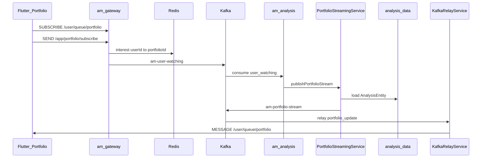
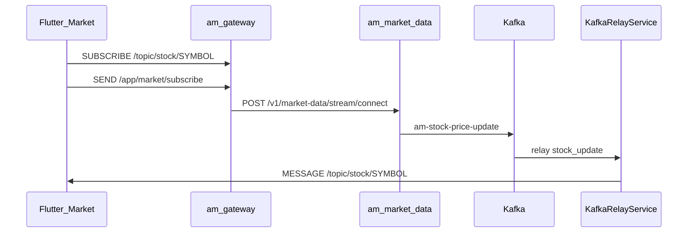
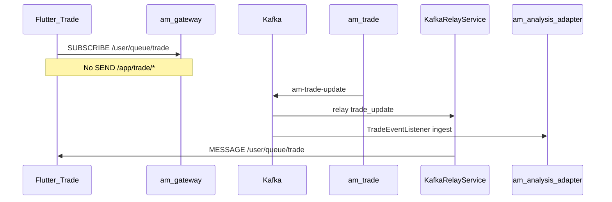
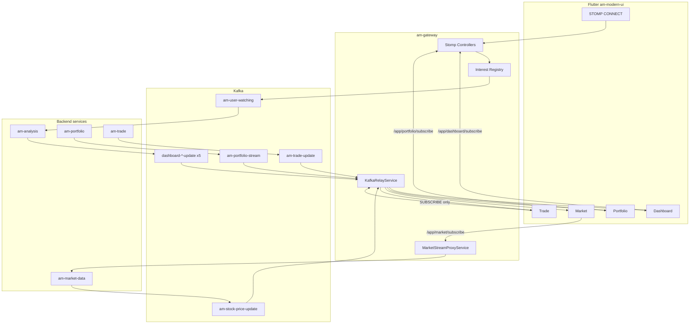

# Gateway streaming guide — Portfolio, Market, Trade, Dashboard

How live data flows from backend Kafka topics through **am-gateway** [`KafkaRelayService`](../../services/am-gateway/src/main/java/com/am/gateway/service/KafkaRelayService.java) to Flutter over STOMP.

**Transport:** WebSocket upgrade at `GET /v1/streams` → STOMP `CONNECT` with JWT (see [`SecurityConfig`](../../services/am-gateway/src/main/java/com/am/gateway/config/SecurityConfig.java)). Not UDP.

---

## KafkaRelayService — full relay matrix

| Kafka topic | Consumer group | Handler | STOMP destination | Relay type |
|-------------|----------------|---------|-------------------|------------|
| `am-stock-price-update` | `am-gateway-stock-group` | `handleStockUpdate` | `/topic/stock/{symbol}` | Broadcast per symbol |
| `am-portfolio-update` | `am-gateway-portfolio-group` | `handlePortfolioStreamUpdate` | `/user/queue/portfolio` | Per-user queue |
| `am-portfolio-stream` | `am-gateway-portfolio-group` | same | `/user/queue/portfolio` | Per-user queue |
| `am-trade-update` | `am-gateway-trade-group` | `handleTradeUpdate` | `/user/queue/trade` | Per-user queue |
| `dashboard-summary-update` | `am-gateway-dashboard-summary-group` | `handleDashboardSummaryUpdate` | `/user/queue/dashboard/summary` | Per-user queue |
| `dashboard-activity-update` | `am-gateway-dashboard-activity-group` | `handleDashboardActivityUpdate` | `/user/queue/dashboard/activity` | Per-user queue |
| `dashboard-allocation-update` | `am-gateway-dashboard-allocation-group` | `handleDashboardAllocationUpdate` | `/user/queue/dashboard/allocation` | Per-user queue |
| `dashboard-movers-update` | `am-gateway-dashboard-movers-group` | `handleDashboardMoversUpdate` | `/user/queue/dashboard/movers` | Per-user queue |
| `dashboard-history-update` | `am-gateway-dashboard-history-group` | `handleDashboardHistoryUpdate` | `/user/queue/dashboard/history` | Per-user queue |
| `dashboard-update` (legacy) | `am-gateway-dashboard-legacy-group` | `handleDashboardUpdate` | `/topic/dashboard/{userId}` | Broadcast |

**Flow log spans:**

| Span | When |
|------|------|
| `gateway.kafka.relay.stock_update` | Each `am-stock-price-update` batch |
| `gateway.kafka.relay.portfolio_update` | Portfolio event consumed |
| `gateway.ws.send.queue_portfolio` | Before `convertAndSendToUser` for portfolio |
| `gateway.kafka.relay.trade_update` | Trade event consumed |
| `gateway.kafka.relay.dashboard_*` | Dashboard widget consumed |
| `gateway.ws.send.dashboard_widget` | Before `convertAndSendToUser` for dashboard widget |

---

## UI → Gateway controllers

All `/app/*` routes are handled by [`controller/`](../../services/am-gateway/src/main/java/com/am/gateway/controller/) (prefix `/app` from [`WebSocketConfig`](../../services/am-gateway/src/main/java/com/am/gateway/config/WebSocketConfig.java)).

| Controller | STOMP SEND | Flutter caller | Downstream |
|------------|------------|----------------|------------|
| *(SecurityConfig)* | `CONNECT` | `StompConnectionCubit` / `app_shell.dart` | JWT → Principal |
| `DashboardStompController` | `/app/dashboard/subscribe` | `dashboard_repository.dart` | Redis + `am-user-watching` |
| `DashboardStompController` | `/app/dashboard/unsubscribe` | `dashboard_repository.dart` | Deregister |
| `PortfolioStompController` | `/app/portfolio/subscribe` | `portfolio_cubit.dart` | Redis + `am-user-watching` |
| `PortfolioStompController` | `/app/portfolio/heartbeat` | *(not wired in UI)* | TTL refresh |
| `PortfolioStompController` | `/app/portfolio/unsubscribe` | *(not wired in UI)* | Deregister |
| `MarketStompController` | `/app/market/subscribe` | `price_service.dart` | am-market REST connect |
| *(none)* | `/app/trade/*` | *(none)* | Trade is **passive relay only** |

User id for `/app/*` comes from JWT via [`StompPrincipalResolver`](../../services/am-gateway/src/main/java/com/am/gateway/controller/StompPrincipalResolver.java) — never trust client payload alone.

---

## Stream comparison

| Aspect | Dashboard | Portfolio | Market | Trade |
|--------|-----------|-----------|--------|-------|
| UI SUBSCRIBE | 5× `/user/queue/dashboard/*` | 1× `/user/queue/portfolio` | N× `/topic/stock/{symbol}` | 1× `/user/queue/trade` |
| UI SEND | `/app/dashboard/subscribe` | `/app/portfolio/subscribe` | `/app/market/subscribe` | None |
| Interest registry | `CHANNEL:DASHBOARD_MAIN` | `{portfolioId}` | None | None |
| Kafka out (to gateway) | 5 widget topics | `am-portfolio-stream` | `am-stock-price-update` | `am-trade-update` |
| Publisher | am-analysis | am-analysis | am-market-data | am-trade |
| Demand-driven | Yes (orchestrator) | Yes (orchestrator → Mongo + stream) | No (upstream connect only) | No (event-driven publish) |

Detailed dashboard design: [dashboard-streaming/implementation-plan.md](../dashboard-streaming/implementation-plan.md).

---

## 1. Portfolio — `/user/queue/portfolio`

### Flow



On **`am-stock-price-update`**, the orchestrator parses tick prices, debounces 2s per portfolio, and calls `PortfolioStreamingService` with an in-memory price overlay (`GainLossCalculator`) — no `am-trigger-calculation` hop.

### Producer

[`PortfolioStreamingService`](../../services/am-analysis/src/main/java/com/am/analysis/service/PortfolioStreamingService.java) publishes `PortfolioUpdateEvent` to **`am-portfolio-stream`** (reads Mongo `AnalysisEntity` populated by [`am-analysis-adapter`](../../libraries/am-analysis-adapter)).

Legacy rollback: set `am.analysis.portfolio.streaming.legacy-trigger-calc=true` to restore orchestrator → `am-trigger-calculation` → am-portfolio.

### Gateway relay

Parses `PortfolioUpdateEvent`, maps via `AnalysisEventMapper`, sends `PortfolioUpdateDto` to:

```java
messagingTemplate.convertAndSendToUser(userId, "/queue/portfolio", optimizedPayload);
```

### Common failures

| Symptom | Cause | Fix / check |
|---------|-------|-------------|
| Queue subscribed, no backend action | Missing `/app/portfolio/subscribe` | Portfolio tab must SEND after SUBSCRIBE |
| `user_watching` ok, no portfolio Kafka | Orchestrator not consuming (`partitions: []`) | Separate groups: `am-orchestrator-watching-group` |
| Kafka has messages, no relay | Gateway group `am-gateway-portfolio-group` empty partitions | Kafka UI consumer assignment |
| Relay ok, UI silent | JWT `sub` ≠ event `userId` | Compare `user=` in connect vs relay logs |
| Update ignored | `portfolioId` mismatch in cubit | [`updateSummaryFromSocket`](../../../am-modern-ui/am_portfolio_ui/lib/features/portfolio/presentation/cubit/portfolio_cubit.dart) |

---

## 2. Market — `/topic/stock/{symbol}`

### Flow

Two independent steps (unlike portfolio/dashboard):

1. **SUBSCRIBE** `/topic/stock/{symbol}` — receive Kafka-relayed prices
2. **SEND** `/app/market/subscribe` — gateway proxies upstream symbol connect to am-market



### Gateway relay

For each price in `EquityPriceUpdateEvent`:

```java
messagingTemplate.convertAndSend("/topic/stock/" + symbol, priceJson);
```

Broadcast topic — **not** per-user. UI must SUBSCRIBE each symbol.

### Shared topic consumers (by design)

| Service | Group | Role |
|---------|-------|------|
| am-gateway | `am-gateway-stock-group` | Relay to WebSocket |
| am-analysis adapter | `am-analysis-group` | Mongo ingest |
| am-analysis orchestrator | `am-orchestrator-stock-group` | Dashboard fanout on tick |

### Common failures

| Symptom | Cause | Fix / check |
|---------|-------|-------------|
| SUBSCRIBE storm + UNSUBSCRIBE burst | UI resync / PriceService dispose | Add-only subscribe; `priceServiceProvider` keepAlive |
| SUBSCRIBE ok, no MESSAGE | Upstream connect failed | `gateway.market.connect.proxy status=err` |
| Wrong symbol updates | Path vs payload mismatch | Symbol string must match exactly (spaces/casing) |
| Cap at 20 symbols | `_maxLiveStreamSymbols` in MarketProvider | Expected; REST for remainder |

---

## 3. Trade — `/user/queue/trade`

### Flow (passive — no gateway controller)

Trade streaming is **receive-only** from the UI perspective. There is no `/app/trade/subscribe` and no Redis interest registry.



### Gateway relay

```java
// Requires userId in JSON body
messagingTemplate.convertAndSendToUser(userId, "/queue/trade", message);
```

Raw JSON string relayed (not DTO-mapped like portfolio).

### UI

[`trade_controller_repository_impl.dart`](../../../am-modern-ui/am_trade_ui/lib/features/trade/internal/data/repositories/trade_controller_repository_impl.dart):

- SUBSCRIBE `/user/queue/trade` on first portfolio load
- Filters frames where `destination == '/user/queue/trade'` exactly

**Gap:** Spring may deliver destination as `/user/{userId}/queue/trade`. UI filter may miss frames — use suffix match like dashboard `_matchesDestination`.

### Side effect on portfolio/dashboard

`am-trade-update` is also consumed by **am-analysis adapter** → may trigger orchestrator recalc for portfolio watchers (see ARCHITECTURE.md trade-driven recalc). Trade UI push and analysis ingest share the same topic.

### Common failures

| Symptom | Cause | Fix / check |
|---------|-------|-------------|
| Never receive updates | Topic empty in preprod | Confirm am-trade publishes to `am-trade-update` |
| Relay ok, UI silent | Destination header mismatch | Fix UI filter for user-prefixed destination |
| `missing_userId` in relay | Malformed Kafka payload | Trade producer must include `userId` |
| No `/app/trade/subscribe` | By design today | Optional P1: add controller if demand-driven trade watch needed |

---

## 4. Dashboard — five Kafka topics (reference)

Publisher: [`DashboardAnalysisService`](../../services/am-analysis/src/main/java/com/am/analysis/service/DashboardAnalysisService.java) → topics `dashboard-*-update`.

Orchestrator: [`DemandDrivenOrchestrator`](../../services/am-analysis/src/main/java/com/am/analysis/service/orchestrator/DemandDrivenOrchestrator.java) on `am-user-watching` + market tick fanout.

Gateway: `relayDashboardWidget` extracts `data` from `{ userId, data }` envelope.

Full checklist: [log-verification-checklist.md](./log-verification-checklist.md) §1.

---

## Architecture diagram (all streams)



---

## What's next

### P0 — Deploy and verify

- Deploy gateway (split consumer groups), analysis (orchestrator groups), UI (subscribe fixes).
- Run [log-verification-checklist.md](./log-verification-checklist.md) for all four tabs.

### P1 — Portfolio and trade UX

- Wire `/app/portfolio/heartbeat` and `/app/portfolio/unsubscribe` in Flutter.
- Fix trade STOMP destination matching (user-prefixed path).
- Document `portfolioId` / `userId` contract in Kafka events.

### P2 — Market hardening

- Optional aggregated `/topic/stock/batch` to reduce STOMP subscription count.
- Gateway `/app/market/disconnect` proxy (not implemented).

### P3 — Trade demand-driven (optional)

- Add `TradeStompController` + interest registry if trade page needs watch registration like portfolio.
- Until then, trade remains **passive**: UI SUBSCRIBE + wait for `am-trade-update` publishes.

### P4 — Observability

- Unified dashboard in Grafana/Loki for `[FLOW]` spans across streams.
- Kafka UI alerts when gateway consumer group has zero partition assignment.

---

## See also

- [README.md](./README.md) — doc index
- [ARCHITECTURE.md](../ARCHITECTURE.md)
- [dashboard-streaming](../dashboard-streaming/README.md)
