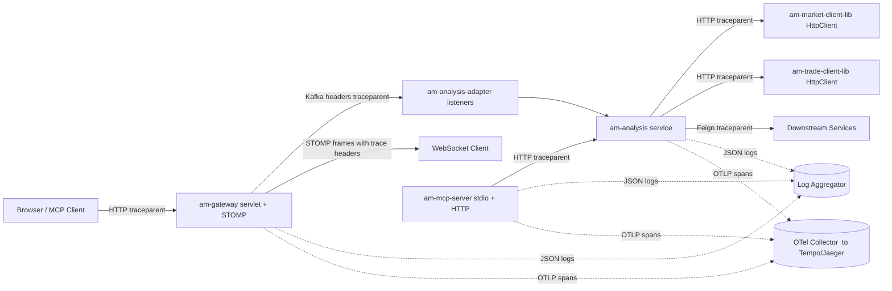

# Observability Architecture — am-core-services

> Single source of truth for the distributed tracing and structured logging stack across `am-gateway`, `am-analysis`, and `am-mcp-server` (and any future service that adopts `am-observability-lib`).

---

## 1. Goals

1. **One `traceId` per business request** — visible from the edge (HTTP / WebSocket) through Kafka, downstream HTTP, Mongo, and Redis, in every log line and in a trace backend.
2. **Human-readable end-to-end flow** — an engineer can grep one log file (or query Kibana/Loki) by `traceId` or `flow.id` and read the request story in chronological order.
3. **Zero-effort adoption** — a new service adds a single Maven dependency and a 1-line `logback-spring.xml`. Everything else (filter, MDC, exception handler, Kafka/Feign/SDK propagation) is auto-configured.
4. **Safe by default** — no JWTs, passwords, account numbers, or oversized JSON bodies are ever logged in INFO.

## 2. Stack chosen

| Concern | Choice | Why |
|---|---|---|
| Distributed tracing API | **Micrometer Tracing** (`io.micrometer:micrometer-tracing`) | Spring Boot 3 native; auto-instruments Servlet, RestTemplate, RestClient, WebClient, Feign, KafkaTemplate, `@KafkaListener`, `@Async`, `@Scheduled`. |
| Propagation format | **W3C `traceparent` / `tracestate`** | Industry standard; interoperates with OTel, Jaeger, Tempo, Grafana Cloud, Datadog. |
| Span exporter | **OpenTelemetry OTLP** (`io.micrometer:micrometer-tracing-bridge-otel` + `io.opentelemetry:opentelemetry-exporter-otlp`) | Future-proof; ships to any OTel collector with no app changes. |
| Trace backend (dev) | **Jaeger** (via OTel collector) | Free, fast, runs locally in Docker. Tempo/Datadog work in higher environments by swapping the OTLP endpoint env var. |
| Log format | **JSON** via `net.logstash.logback:logstash-logback-encoder` | Machine-parseable in ELK/Loki/Datadog; the `message` field is still kept human-readable. |
| MDC propagation across threads | **`MdcTaskDecorator`** + Micrometer's `ContextSnapshot` | Survives `@Async`, `CompletableFuture`, executors. |
| Flow checkpoints | **In-house `FlowLogger`** in `am-observability-lib` | Standardized business-flow log shape distinct from technical logs. |
| Error response shape | **`ApiResponse.error(...)`** from `am-common-lib` | Already in use; reused by the new global `@ControllerAdvice`. |

We **rejected**:

- **Spring Cloud Sleuth** (deprecated in Boot 3; replaced by Micrometer Tracing).
- **B3 / Zipkin propagation** (we want W3C; B3 is in legacy clients only).
- **Pure UUID correlation IDs** (no tree structure, no spans, no parent/child relationships).
- **Plain-text logs** (acknowledged less readable than JSON for end-to-end correlation across services).

## 3. High-level architecture



## 4. `am-observability-lib` — module contents

Path: `libraries/am-observability-lib/`

```
com.am.observability
├── config
│   └── ObservabilityAutoConfiguration.java   # @AutoConfiguration; registered in spring.factories
├── web
│   ├── TraceContextFilter.java               # OncePerRequestFilter — populates MDC
│   └── RequestLoggingFilter.java             # one structured line per HTTP request
├── kafka
│   ├── TracingKafkaProducerInterceptor.java  # safety net on top of Boot auto-instrumentation
│   └── TracingKafkaConsumerInterceptor.java  # restores MDC on consume
├── feign
│   └── TraceContextFeignInterceptor.java     # propagates X-Correlation-Id, X-User-Id
├── http
│   └── TraceContextSdkInterceptor.java       # Consumer<HttpRequest.Builder> for generated SDKs
├── stomp
│   └── StompTracingChannelInterceptor.java   # opens spans for STOMP frames
├── flow
│   ├── FlowLogger.java                       # business-flow checkpoint API
│   ├── FlowSpan.java                         # AutoCloseable timer + MDC scope
│   └── FlowMarkers.java                      # SLF4J `FLOW` marker
├── error
│   └── ObservabilityControllerAdvice.java    # global @ControllerAdvice returning ApiResponse
├── sanitize
│   └── Sanitizer.java                        # mask/truncate utility
├── mdc
│   └── MdcTaskDecorator.java                 # @Async / CompletableFuture MDC propagation
└── resources
    ├── META-INF/spring/org.springframework.boot.autoconfigure.AutoConfiguration.imports
    └── am-logback-include.xml                # shared logback include
```

Auto-config triggers on `@ConditionalOnClass(Tracer.class)` and `@ConditionalOnProperty(name = "am.observability.enabled", havingValue = "true", matchIfMissing = true)` so it can be turned off per-service.

## 5. Propagation rules

| Hop | Transport | Header(s) carried | Instrumentation |
|---|---|---|---|
| Browser → gateway | HTTP (or WS upgrade) | `traceparent`, `tracestate`, fallback `X-Request-Id`/`X-Correlation-Id` | `TraceContextFilter` + Boot auto-instrumentation |
| WebSocket STOMP | STOMP native headers | `traceparent` (custom in STOMP CONNECT/SEND/SUBSCRIBE) | `StompTracingChannelInterceptor` |
| Service → service | HTTP via Feign | `traceparent`, `X-User-Id`, `X-Correlation-Id` | Boot auto + `TraceContextFeignInterceptor` |
| Service → service | HTTP via generated `java.net.http` SDK | `traceparent`, `X-User-Id`, `X-Correlation-Id` | `TraceContextSdkInterceptor` registered in each `*ClientConfig` |
| Service → service | HTTP via RestTemplate / RestClient | `traceparent` | Boot auto |
| Service → service | Kafka | record headers: `traceparent`, `X-Correlation-Id`; **plus** payload fields (`traceId`, `spanId`) for backward compatibility with `PortfolioUpdateEvent`, `TriggerCalcEvent`, `UserWatchingEvent` | Boot auto + `TracingKafkaProducerInterceptor` |
| MCP tools (stdio) | n/a (in-process) | n/a | AOP enriches MDC with `tool.name`, `tool.args.size` |

## 6. MDC schema (every JSON log line)

| Field | Type | Source | Always present? |
|---|---|---|---|
| `traceId` | hex 32 | Micrometer Tracer (Otel TraceContext) | yes (after filter runs) |
| `spanId` | hex 16 | Micrometer Tracer | yes |
| `service` | string | `${spring.application.name}` | yes |
| `userId` | string | JWT claim via `am-security-lib.TokenExtractor` | when authenticated |
| `correlationId` | string | `X-Correlation-Id` header, else generated UUID | yes |
| `flow.id` | string | defaults to `traceId`; can be overridden for Kafka-rooted flows | when inside a `FlowLogger` scope |
| `flow.step` | string | current step name passed to `FlowLogger.start(...)` | when inside a step |
| `flow.duration_ms` | long | computed on `complete` / `fail` | on close lines |
| `flow.outcome` | enum `ok` / `err` | computed on `complete` / `fail` | on close lines |
| `flow.user` | string | mirrors `userId` for query convenience | when known |
| `request.method` / `request.path` | string | from servlet request | for HTTP flows |
| `http.status` | int | from response | on response logs |
| `marker` | string | SLF4J marker name (e.g. `FLOW`) | for flow lines |
| `tool.name` / `tool.args.size` | string / int | MCP AOP | inside MCP tool calls |
| `caller.class` / `caller.method` / `caller.file` / `caller.line` | string / string / string / int | logback `<callerData/>` provider; resolves a stack frame per event | every JSON log line (disable via `am.observability.caller.enabled=false`) |

## 7. Flow logging — the human-readable layer

Underneath the JSON shape, every business-flow log line follows a fixed `message` template:

```
[FLOW step=<dotted.step.name> flow=<flow.id> user=<userId> status=<ok|err> dur_ms=<n>] <one-line summary>
```

This is what `FlowLogger.start(...)` / `.step(...)` / `.complete(...)` / `.fail(...)` emit. The marker `FLOW` lets engineers filter business events away from chatty technical/debug logs.

Naming convention: `<service>.<area>.<verb>[.detail]`.

Reference flows already mapped:

- `gateway.stomp.connect|subscribe|heartbeat|unsubscribe`
- `gateway.kafka.relay.portfolio_update|stock_update|trade_update|dashboard_update`
- `gateway.ws.send.queue_portfolio`
- `analysis.http.dashboard.summary|performance|allocation` and friends
- `analysis.aggregator.fetch_portfolios|fetch_trades`
- `analysis.aggregator.fallback.portfolio|trade`
- `analysis.market.search_securities|historical_batch`
- `analysis.kafka.consume.portfolio_update|user_watching|stock_update`
- `analysis.kafka.publish.dashboard_update|trigger_calculation`
- `mcp.tool.<tool_name>`

## 8. Example end-to-end story

A user opens the dashboard:

1. Browser sends `GET /v1/analysis/dashboard/summary` with `Authorization: Bearer …` and no `traceparent`.
2. `am-analysis` `TraceContextFilter` generates a new trace, populates MDC, and emits an **access** log line.
3. `AnalysisController.getDashboardSummary` enters → `FlowLogger.start("analysis.http.dashboard.summary", "userId", u)`.
4. `AnalysisAggregator.fetchPortfolioEntities(u)` runs inside `analysis.aggregator.fetch_portfolios` step → Mongo `findByOwnerIdAndType` (Boot auto-instruments the driver and creates a child span).
5. `AnalysisAggregator.fetchTradePortfolios(u)` runs inside `analysis.aggregator.fetch_trades` → `TradeClientService` makes a `java.net.http` SDK call. `TraceContextSdkInterceptor` injects `traceparent` on the outbound request, so the downstream trade service joins the same trace.
6. Controller returns → `FlowLogger.complete(span, "portfolios", 4, "holdings", 37, "isComplete", true)`.
7. `RequestLoggingFilter` emits the closing access log with status, duration, content size.

All seven steps share the same `traceId` in the JSON logs and form a connected trace in Jaeger.

## 9. Service-side responsibilities

Each adopting service must:

1. Add `am-observability-lib` to its `pom.xml`.
2. Replace its `logback-spring.xml` with `<include resource="am-logback-include.xml"/>`.
3. Paste the `management.tracing` + `management.otlp` + `otel.service` block into `application.yml`.
4. Wrap each REST controller method and each `@KafkaListener` body in a `FlowLogger.start(...)`/`.complete(...)` scope using a step name from the convention.
5. Never log full inbound payloads at INFO — use `Sanitizer.preview(...)` instead.
6. Pull `traceId`/`spanId` for Kafka payloads from the current span via the helper rather than `UUID.randomUUID()`.

Section 6 of the [Developer Guide](DEVELOPER_GUIDE.md) has the exact snippets.

## 10. Local dev infrastructure

[docker-compose.dev.yml](../../docker-compose.dev.yml) gets three new services:

- `otel-collector` — `otel/opentelemetry-collector-contrib`, listens OTLP on `:4318`.
- `jaeger` — `jaegertracing/all-in-one`, UI on `:16686`.
- `grafana` *(optional)* — preconfigured Jaeger datasource.

Each Spring service runs with `OTEL_EXPORTER_OTLP_TRACES_ENDPOINT=http://otel-collector:4318/v1/traces`.

## 11. Environment variables

| Variable | Default | Effect |
|---|---|---|
| `OTEL_EXPORTER_OTLP_TRACES_ENDPOINT` | `http://localhost:4318/v1/traces` | Where spans are pushed. Set to your environment's OTel collector. |
| `TRACING_SAMPLING_PROBABILITY` | `1.0` | Span sample rate. Lower in prod for high-traffic services. |
| `AM_OBSERVABILITY_ENABLED` | `true` | Master switch for the auto-config. |
| `AM_OBSERVABILITY_REQUEST_LOG_ENABLED` | `true` | Disable the per-request access log if it's too noisy. |
| `AM_OBSERVABILITY_SANITIZE_PREVIEW_BYTES` | `256` | Max chars of payload preview emitted at DEBUG. |
| `LOGGING_STRUCTURED_FORMAT` | `json` | Set to `text` only in last-resort local debugging. |

## 12. Backward compatibility

- Existing payload fields (`PortfolioUpdateEvent.traceId/spanId`, `TriggerCalcEvent.*`, `UserWatchingEvent.*`) are kept. Producers now populate them from the current Micrometer span; consumers can still read them as plain strings.
- The existing `X-Correlation-Id` Kafka header set by `GatewayKafkaProducer` is preserved and now mirrored from MDC `correlationId`.
- The existing `am-feign-lib` `AuthRequestInterceptor` is unchanged; the new `TraceContextFeignInterceptor` is added alongside it.

## 13. Out of scope

- Metrics dashboards (Prometheus / Grafana panels).
- Log shipping infrastructure (Fluentbit, Promtail, Vector).
- Adoption inside other repos in the workspace (`am-fin-agent`, `am-portfolio`, `am-market`, `am-doc-intelligence`) — same library can be republished and reused; a follow-up.
- PII redaction beyond the documented sensitive fields (Sanitizer is extensible by config).

## 14. Risks & mitigations

| Risk | Mitigation |
|---|---|
| 100% sampling at high throughput overloads OTel collector | `TRACING_SAMPLING_PROBABILITY` tunable per service. |
| Existing log volume balloons with JSON encoder | JSON encoder includes everything in a single line; legacy `logging.level.*` settings are honored. Tests profile uses plain text. |
| Kafka header propagation conflicts with non-tracing consumers | Headers are additive — any existing consumer that ignored headers continues to work. |
| WebSocket STOMP doesn't honor `traceparent` from clients | Custom `StompTracingChannelInterceptor` creates a new root trace if the client omits it. |
| Generated SDK regenerations wipe the interceptor wire-up | Wire-up lives in each `*ClientConfig.java` (handwritten), not in generated code. |

## 15. Related documents

- **[Developer Guide](DEVELOPER_GUIDE.md)** — practical onboarding handbook for developers integrating `am-observability-lib` into their service.
- [docs/ARCHITECTURE.md](../ARCHITECTURE.md) — overall service architecture (predates this work).
- Plan file: `.cursor/plans/observability_for_am-core-services_*.plan.md`.
