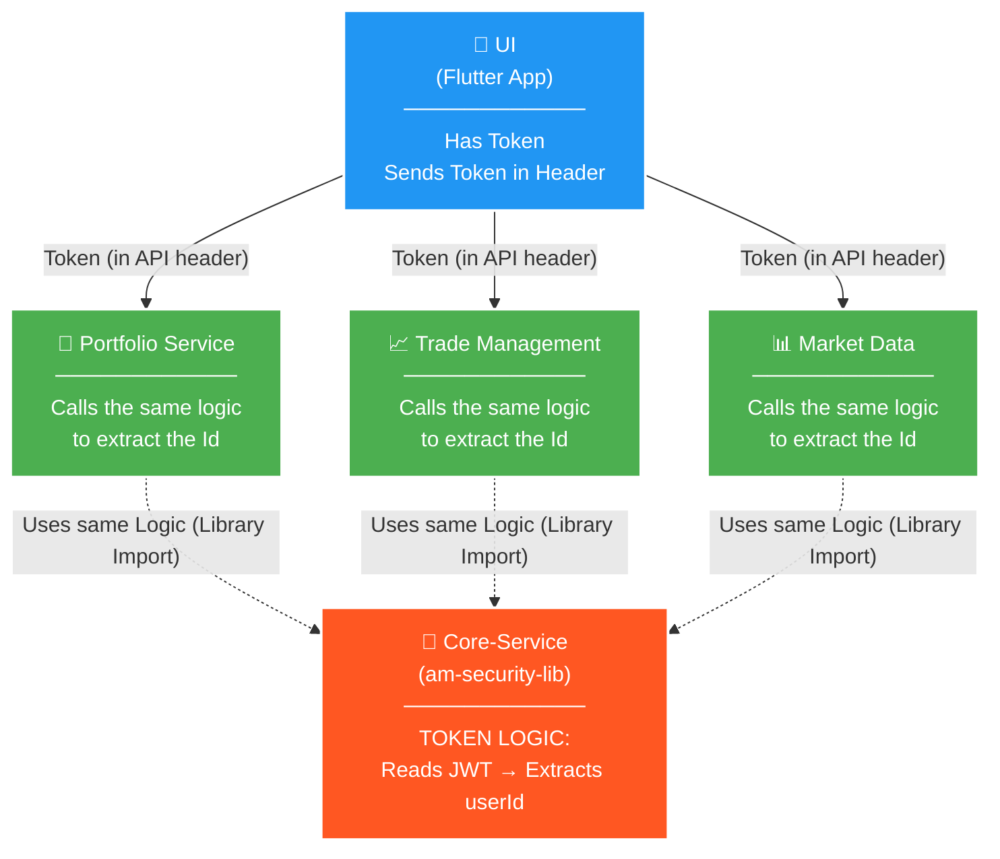

# Service Integration Architecture: Centralized Authentication Flow

## Overview

This document outlines the architectural standard for authentication and user identity flow across the AM ecosystem. It serves as a reference for teams building downstream microservices (such as `am-trade`, `am-market-data`, and `am-portfolio`). 

Our system uses a **Shared Library Pattern** for security, meaning that user identity (`userId`) is **never passed as a URL query parameter or request body field**. Instead, identity is propagated securely via JWT Tokens in the HTTP headers and processed centrally by a shared core library.

---

## 1. The Architectural Diagram

The following diagram illustrates how the UI, Core Services, and Microservices interact securely.



### Key Concepts

1. **UI (Flutter App):** Holds the JWT Token and automatically injects it into the `Authorization: Bearer <token>` header of every outgoing API request using an Interceptor.
2. **Core-Service (`am-security-lib`):** Contains the centralized security logic. It intercepts incoming HTTP requests, decodes the JWT, extracts the `userId`, and binds it to a thread-local `UserContext`.
3. **Downstream Services (Portfolio, Trade, Market Data):** Do **not** have their own custom JWT parsing logic, nor do they accept `userId` from the frontend. Instead, they import `am-security-lib` as a Maven dependency and retrieve the `userId` directly from the `UserContext`.

---

## 2. Implementation Guide for Microservice Teams

If you are developing a backend service (like `am-trade` or `am-market-data`), you must follow this pattern.

### Step 1: Import the Security Library
Add `am-security-lib` to your `pom.xml`. This automatically brings in the `UserContextFilter` which will intercept incoming requests and validate the token.

```xml
<dependency>
    <groupId>com.am.security</groupId>
    <artifactId>am-security-lib</artifactId>
    <version>1.0.0-SNAPSHOT</version> <!-- Check for latest version -->
</dependency>
```

### Step 2: Remove `userId` from your API Contracts
Your REST Controllers should **never** take `userId` as a `@RequestParam`, `@PathVariable`, or inside a DTO. 

**❌ WRONG (Do not do this):**
```java
@GetMapping("/holdings")
public ResponseEntity<Holdings> getHoldings(@RequestParam String userId) {
    // Bad practice: trusting the client to provide the userId
}
```

**✅ CORRECT:**
```java
@GetMapping("/holdings")
public ResponseEntity<Holdings> getHoldings() {
    // Fetch identity securely from the context
    String userId = UserContext.getUserIdOrThrow(); 
    return ResponseEntity.ok(tradeService.getHoldings(userId));
}
```

### Step 3: Use `UserContext` in Tests
Since the `userId` is pulled from the ThreadLocal context, your unit and integration tests for controllers must populate the `UserContext` before execution and clear it afterward to prevent test pollution.

```java
@BeforeEach
void setUp() {
    UserContext.setUserId("test-user-123");
}

@AfterEach
void tearDown() {
    UserContext.clear();
}
```

---

## 3. Implementation Guide for UI (Flutter) Teams

If you are working on the Flutter UI, ensure that your features do **not** pass `userId` to repositories, use cases, or remote data sources.

### Step 1: Remove `userId` Parameter Drilling
Your Cubits/Blocs should not require the `userId` to be passed in from the UI layer. 

**❌ WRONG:**
```dart
// UI Layer shouldn't have to know about userId for backend routing
cubit.fetchTradeData(userId: authState.userId);
```

**✅ CORRECT:**
```dart
// Just fetch the data. The network layer handles authentication.
cubit.fetchTradeData();
```

### Step 2: Ensure AuthInterceptor is Configured
Ensure your `Dio` client uses the centralized `AuthInterceptor`. The interceptor automatically attaches the stored JWT to the headers.

```dart
// Example of what happens automatically in the network layer
options.headers['Authorization'] = 'Bearer $token';
```

---

## Conclusion

By adhering to this **Shared Library Architecture**, we ensure:
- **Security:** Clients cannot spoof another user's identity by modifying a `?userId=X` query parameter.
- **DRY Principle:** JWT parsing and validation logic is written exactly once in `am-security-lib`.
- **Clean Code:** The UI and Controller layers are drastically simplified by removing redundant parameter drilling.
